实验一----静态RAM
------------

### **一、实验目的**

1.  掌握静态随机存储器 RAM  工作特性及数据的读写方法。
2.  基于信号时序图，了解读写静态随机存储器的原理。

### **二、实验预习**

1、阅读实验指导书，然后回答问题。

实验所用的静态[存储器](https://so.csdn.net/so/search?q=%E5%AD%98%E5%82%A8%E5%99%A8&spm=1001.2101.3001.7020)由一片 6116（**2K\*8bit** ）构成（位于MEM 单元），6116 有三个控制线：CS 表示（ **片选线** ） ,   OE 表示（  **读线**） ,   WE 表示（ **写线** ） 其功能如实验指导书表 2-1-1 所示，当片选有效CS=（**0** ）时，OE=（**0** ） 时进行读操作，WE=（ **0** ） 时进行写操作，本实验将 CS 常接地。

2、根据 SRAM 6116 [集成电路](https://so.csdn.net/so/search?q=%E9%9B%86%E6%88%90%E7%94%B5%E8%B7%AF&spm=1001.2101.3001.7020)的管脚图回答问题。

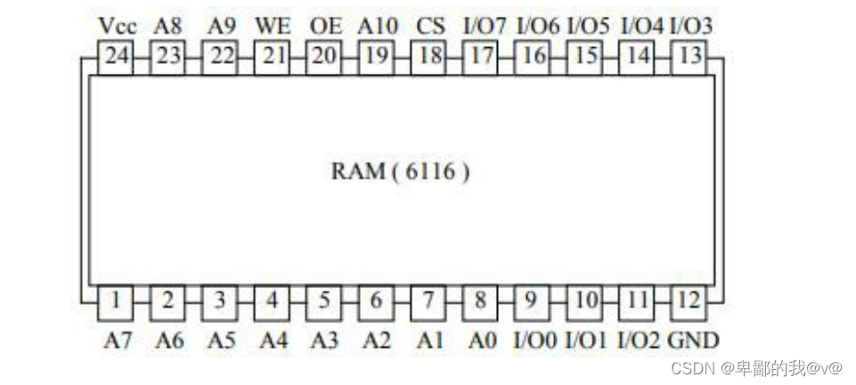

*   地址线的管脚号: (**1-8** **、19、22、23**）
*   数据线的管脚号: ( **9-17**）
*   片选线管脚号   （**18** ）
*   读线管脚号：   （ **20**）
*   写线管脚号：   （**21** ）

3、根据[存储器实验](https://so.csdn.net/so/search?q=%E5%AD%98%E5%82%A8%E5%99%A8%E5%AE%9E%E9%AA%8C&spm=1001.2101.3001.7020)原理图回答问题。

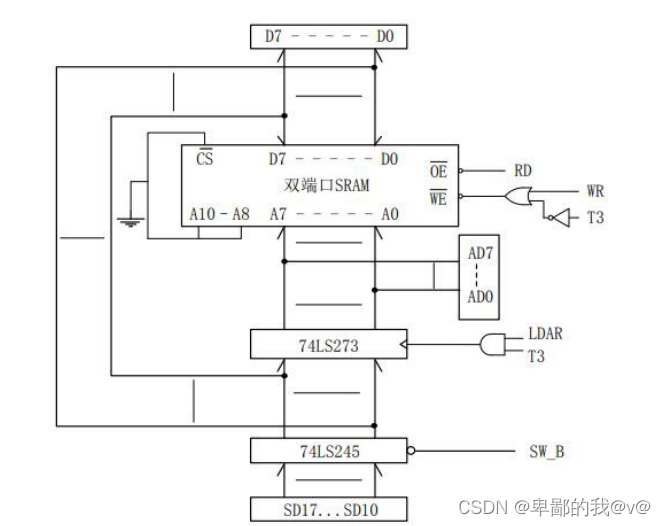

1.   74LS273 的作用：**地址锁存器(内嵌于ABI中)，给出地址**
2.   74LS245 的作用：**三态门，连至CPU内总线，分时给出地址和数据**
3.  信号 LDAR 的作用：: **地址寄存器门控信号，对地址寄存器AR进行加载的控制信号，LDAR=1 时为加载状态。**
4.  信号 SW\_B 的作用：**开关输出三态门使能信号，为 0 时将 74LS245 输入引脚的值从输出引脚输出，即将 SW7~ SW0 数据发送到数据总线。**

### **三、实验步骤**

#### **连线:**

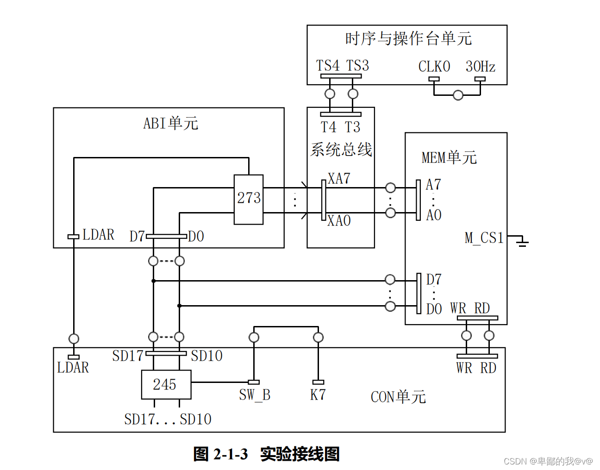

                                                                      实验接线图

*   将时序与操作台单元的开关 KK1、KK3 置为运行档、开关 KK2 置为‘单拍’档（时
    
    序单元的介绍见附录二）
    
*   将 CON 单元的 K7 开关（SW\_B）置为 1（使 SD17..SD10 开关组无输出）打开电源开
    
    关，如果听到有‘嘀’报警声，说明有总线竞争现象，应立即关闭电源，重新检查接线，直到错误排除。
    

#### 操作:

按表进行

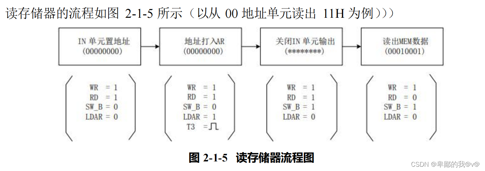

    **给存储器的** **00H****、****01H** **地址单元中分别写入数据** **11H****、****12H****。由前面的存储器实验原理**

**图（图** **2-1-2****）可以看出，由于数据和地址由同一个数据开关给出，因此数据和地址要****分时写入****。**

        **先写地址**：按动 2 次时序单元的 ST 按钮，产 生 T1、T2节拍后，先 关 掉 存 储 器 的 读 写 （WR=1， RD=1），开关 SD17..SD10 输出地址 00H（SD17..SD10=0000 0000B，K7=0），然后 ，打开地址寄存器门控信号（LDAR=1），按动 1 次 ST 产生 T3 脉冲，即将地址 00H 写入到 AR 中，按动 1 次 ST 产生 T4 脉冲，第 1 个机器周期结束。

        **再写数据：** 按动 2 次时序单元的 ST 按钮，产生 T1、T2 节拍后，先关掉地址寄存器门控  
信号（LDAR=0），数据开关输出要写入的数据 11H（SD17..SD10 = 0001 0001B），打开三态  
门（K7=0），然后使存储器处于写状态（WR=0，RD=1），按动 1次 ST产生 T3脉冲，即将数  
据11H 写入到存储器 00H 地址中，按动1次ST产生T4脉冲，第2个机器周期结束。

                                重复上述操作，继续向01H地址单元中写入数据 12H。

        **再读数据：**按动 2次时序单元的 ST 按钮，产生T1、T2节拍后，先关掉地址寄存器门控信号(LDAR=0),关闭 IN 单元的输出(SW\_B=1),然后使存储器处于读状态（WR=1，RD=0),此时数据总线上的数即为从存储器当前地址中读出的数据内容。按动2次 ST产生 T3、T4 脉冲，一 个机器周期结束。

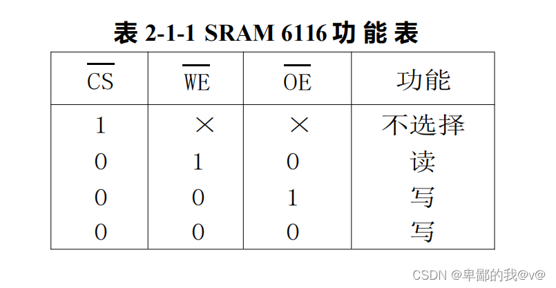

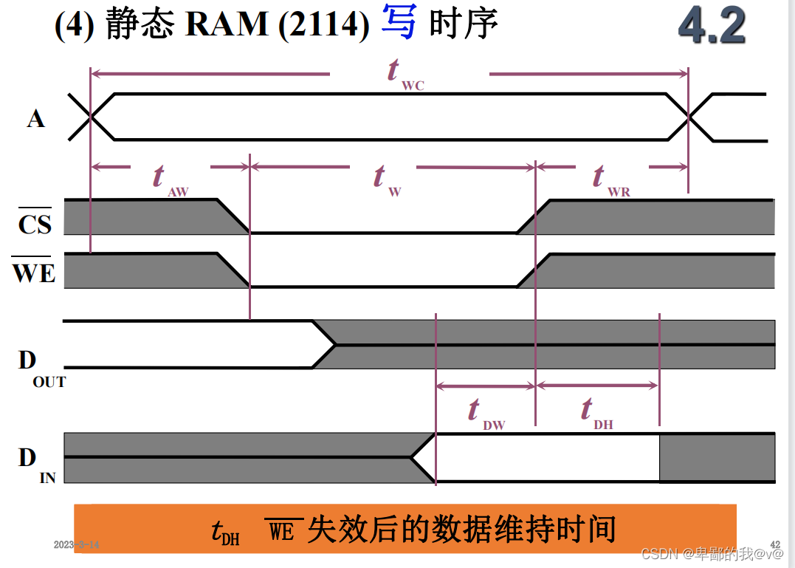

#### **实验原始记录**

**（一）本机运****行**

1、给存储器的 00H 和 01H 地址单元写入数据（数值自定义）。

表 2-1 00H 存储单元写操作实验结果

<table border="1" cellspacing="0"><tbody><tr><td colspan="2">
写操作步骤
</td><td colspan="4">
控制信号状态
</td></tr><tr><td rowspan="2">
IN&nbsp;单元置地址
</td><td>
地址信息
</td><td>
WR
</td><td>
RD
</td><td>
SW_B
</td><td>
LDAR
</td></tr><tr><td>
00000000/00H
</td><td>
1
</td><td>
1
</td><td>
0
</td><td>
0
</td></tr><tr><td rowspan="2">
地址写入 AR
</td><td>
地址信息
</td><td>
WR
</td><td>
RD
</td><td>
SW_B
</td><td>
LDAR
</td></tr><tr><td>
00000000/00H
</td><td>
1
</td><td>
1
</td><td>
0
</td><td>
1
</td></tr><tr><td rowspan="2">
IN&nbsp;单元置数据
</td><td>
数据信息
</td><td>
WR
</td><td>
RD
</td><td>
SW_B
</td><td>
LDAR
</td></tr><tr><td>00010001/11H</td><td>
1
</td><td>
1
</td><td>
0
</td><td>
0
</td></tr><tr><td rowspan="2">
数据写入 MEM
</td><td>
数据信息
</td><td>
WR
</td><td>
RD
</td><td>
SW_B
</td><td>
LDAR
</td></tr><tr><td>00010001/11H</td><td>
0
</td><td>
1
</td><td>
0
</td><td>
0
</td></tr></tbody></table>

表 2-2 01H 存储单元写操作实验结果

<table border="1" cellspacing="0"><tbody><tr><td colspan="2">
写操作步骤
</td><td colspan="4">
控制信号状态
</td></tr><tr><td rowspan="2">
IN&nbsp;单元置地址
</td><td>
地址信息
</td><td>
WR
</td><td>
RD
</td><td>
SW_B
</td><td>
LDAR
</td></tr><tr><td>
00010000/01H
</td><td>
1
</td><td>
1
</td><td>
0
</td><td>
0
</td></tr><tr><td rowspan="2">
地址写入 AR
</td><td>
地址信息
</td><td>
WR
</td><td>
RD
</td><td>
SW_B
</td><td>
LDAR
</td></tr><tr><td>
00010000/01H
</td><td>
1
</td><td>
1
</td><td>
0
</td><td>
1
</td></tr><tr><td rowspan="2">
IN&nbsp;单元置数据
</td><td>
数据信息
</td><td>
WR
</td><td>
RD
</td><td>
SW_B
</td><td>
LDAR
</td></tr><tr><td>
00010010/12H
</td><td>
1
</td><td>
1
</td><td>
0
</td><td>
0
</td></tr><tr><td rowspan="2">
数据写入 MEM
</td><td>
数据信息
</td><td>
WR
</td><td>
RD
</td><td>
SW_B
</td><td>
LDAR
</td></tr><tr><td>
00010010/12H
</td><td>
0
</td><td>
1
</td><td>
0
</td><td>
0
</td></tr></tbody></table>

      2、从存储器的 00H 和 01H 地址单元读出数据。

表 2-3 00H 存储单元读操作实验结果

<table border="1" cellspacing="0"><tbody><tr><td colspan="2">
读操作步骤
</td><td colspan="4">
控制信号状态
</td></tr><tr><td rowspan="2">
IN&nbsp;单元置地址
</td><td>
地址信息
</td><td>
WR
</td><td>
RD
</td><td>
SW_B
</td><td>
LDAR
</td></tr><tr><td>
00000000/00H
</td><td>
1
</td><td>
1
</td><td>
0
</td><td>
0
</td></tr><tr><td rowspan="2">
地址写入 AR
</td><td>
地址信息
</td><td>
WR
</td><td>
RD
</td><td>
SW_B
</td><td>
LDAR
</td></tr><tr><td>
00000000/00H
</td><td>
1
</td><td>
1
</td><td>
0
</td><td>
1
</td></tr><tr><td rowspan="2">
关闭 IN&nbsp;单元输出
</td><td>
数据信息
</td><td>
WR
</td><td>
RD
</td><td>
SW_B
</td><td>
LDAR
</td></tr><tr><td>
12H
</td><td>
1
</td><td>
1
</td><td>
1
</td><td>
0
</td></tr><tr><td rowspan="2">
读出 MEM 数据
</td><td>
数据信息
</td><td>
WR
</td><td>
RD
</td><td>
SW_B
</td><td>
LDAR
</td></tr><tr><td>
00010001/12H
</td><td>
1
</td><td>
0
</td><td>
1
</td><td>
0
</td></tr></tbody></table>

表 2-4 01H 存储单元读操作实验结果

<table border="1" cellspacing="0"><tbody><tr><td colspan="2">
读操作步骤
</td><td colspan="4">
控制信号状态
</td></tr><tr><td rowspan="2">
IN&nbsp;单元置地址
</td><td>
地址信息
</td><td>
WR
</td><td>
RD
</td><td>
SW_B
</td><td>
LDAR
</td></tr><tr><td>
00010000/01H
</td><td>
1
</td><td>
1
</td><td>
0
</td><td>
0
</td></tr><tr><td rowspan="2">
地址写入 AR
</td><td>
地址信息
</td><td>
WR
</td><td>
RD
</td><td>
SW_B
</td><td>
LDAR
</td></tr><tr><td>
00010000/01H
</td><td>
1
</td><td>
1
</td><td>
0
</td><td>
1
</td></tr><tr><td rowspan="2">
关闭 IN&nbsp;单元输出
</td><td>
数据信息
</td><td>
WR
</td><td>
RD
</td><td>
SW_B
</td><td>
LDAR
</td></tr><tr><td>
12H
</td><td>
1
</td><td>
1
</td><td>
1
</td><td>
0
</td></tr><tr><td rowspan="2">
读出 MEM 数据
</td><td>
数据信息
</td><td>
WR
</td><td>
RD
</td><td>
SW_B
</td><td>
LDAR
</td></tr><tr><td>
00010010/12H
</td><td>
1
</td><td>
0
</td><td>
1
</td><td>
0
</td></tr></tbody></table>

### ****四、思考题****

根据存储器写入数据的时序图，观察数据何时被写入存储器，受哪些信号影响？（个人理解)

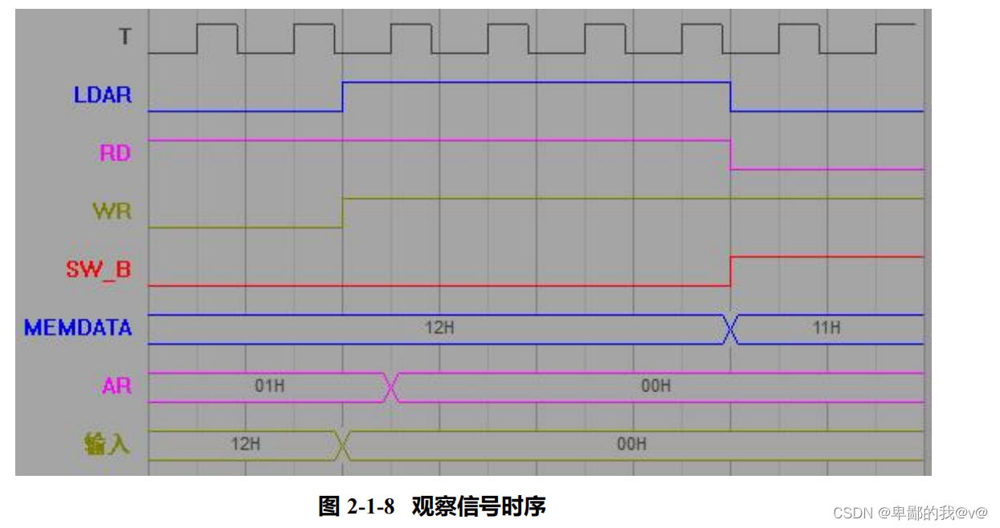

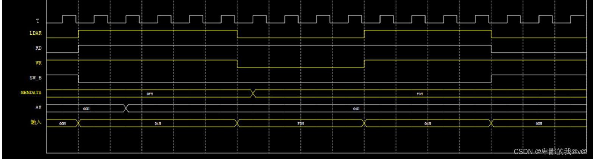

**观察上图，可知最后一个机器周期的 T2 节拍后，RD 有效的同时存储器输出 11H，说明读 存储器受 RD 信号影响。观察倒数第二个机器周期的 T2 节拍后，地址寄存器门控信号 LDAR 有** **效，同时开关 SD17..SD10 已经改为 00H 地址，但是地址寄存器 AR 中的地址直到 T3 时刻上升 沿才发生改变，说明地址寄存器 AR 的写入受 T3 上升沿影响。**

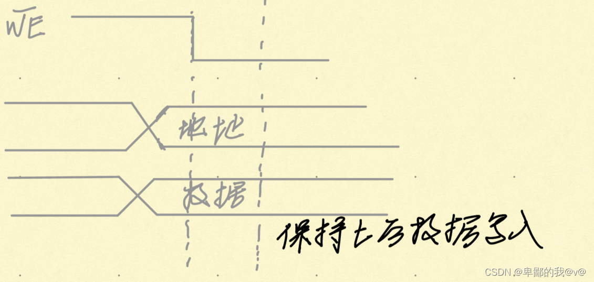

实验二**Cache** **映射机制模拟实验**
-------------------------

### **一、实验目的**

（1）掌握 Cache 的原理及其设计方法。

（2）熟悉 FPGA 应用设计及 EDA 软件的使用。

### **二、实验预习**

*   1、Cache  的地址映像方式有哪些？直接映像方式的特点是什么？
*   **直接映射**       **特点:****主存中的每一块只能被放置到Cache中唯一的一个位置。 (循环分配),****阅览室位置 --只有一个位置可以坐,****空间利用率最低，冲突概率最高，****实现最简单**
*   **全相联映射**
*   **组相连映射**

2、简述直接地址映像方式的地址变换过程。

**如下图所示,主存地址高 位被分成两部分：低c位是指 Cache 的字块地址，高 (t = m-c) 是指主存字块标记，它被记录在建立了对应关系的缓存块的”标记”位中。当缓存接到CPU 送来的主存地址后，只需根据中间 位字段（假设为 0001) 找到 Cache 字块 ，然后根 据字块 的”标记”是否与主存地址的高位相符来判断，若符合且有效位为 “1”(有效位用来识 别Cache 存储块中的数据是否有效，因为有时 Cache 中的数据是无效的，例如，在初始时刻 Cache应该是“空”的，其中的内容是无意义的，表示该 Cache 块巳和主存的某块建立了对应关系（即 己命中），则可根据 位地址从 Cache 中取得信息；若不符合，或有效位为 “0" （即不命中），则从主存读入新的字块来替代旧的字块，同时将信息送往 CPU ，并修改 Cache” 标记＂。如果原来有效 位为 “0” ，还得将有效位置成 “1”。**

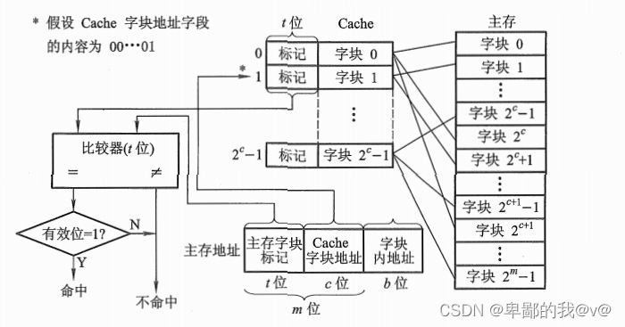

3、在实验连接图中，开关 K7 的作用是什么？H2 指示灯、L7…L0 指示灯和L15…L8指示灯分别表示什么含义？

          **作用:模拟CPU访问存储器的读信号；指示灯含义:显示电位,指示灯亮表示 Cache 失效，H2 指示灯变灭表示 Cache 命中；~作用：显示Cache送往CPU的数据。~作用:显示当前主存数据。**

### 三、实验操作

#### 连线:

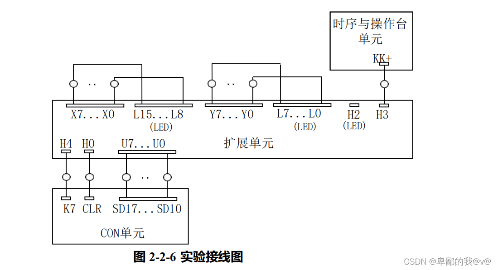

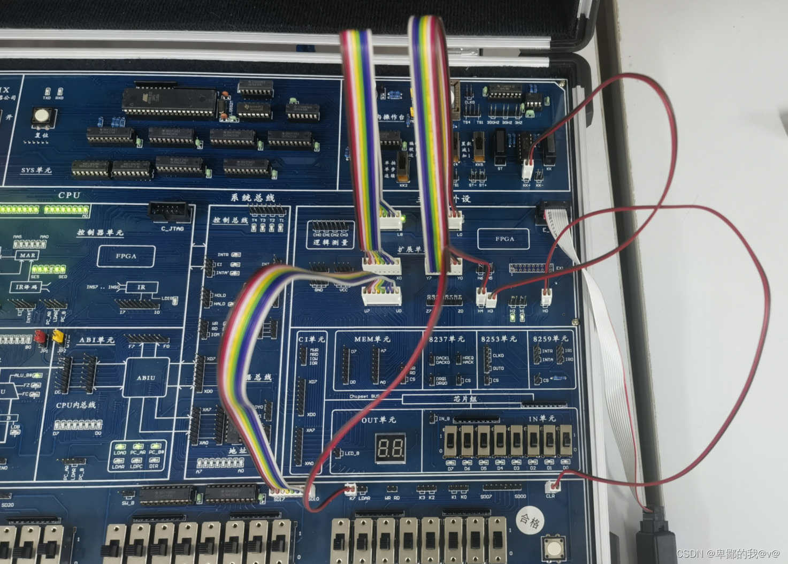

#### 实验步骤:

1.  用 Quartus 软件编辑实现相应的逻辑并进行编译，直到编译通过，Cache控制器在FPGA
    
    芯片中对应的引脚如图 2-2-5所示，框外文字表示连接标号，框内文字表示该引脚的含义。（本实验例程见‘安装路径\\FPGA\\CacheCtrl\\CacheCtrl.qpf’工程）。
    
    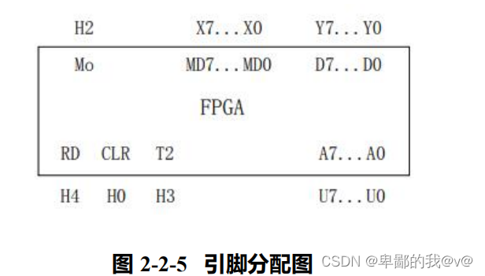
    
2.   打开实验系统电源，将下载电缆插入扩展单元的 E\_JTAG口，把生成的 SOF文件下载到扩 展单元中的 FPGA中。
    
3.  将时序与操作台单元的开关 KK3 置为‘运行’档，CLR 信号由 CON 单元的 CLR 模拟给出，
    
    按动 CON 单元的 CLR 按钮，清空区表。
    
4.  预先往主存写入数据：存储器已经提前装载好了数据文件（RAM.mif），用户也可以自己改写内容。
    
5.  CPU访问主存地址由 CON单元的 SD17…SD10 模拟给出，如 0000 0001。CPU访问主存的读信号由 CON单元的K7模拟给出，置 K7为低，可以观察到扩展单元上的H2指示灯亮,L7…L0指示灯灭，表示 Cache 失效。此时按动 KK 按钮四次，注意 L15…L8 指示灯的变化情况， 地址会依次加一，L15…L8 指示灯上显示的是当前主存数据，按动四次 KK 按钮后，H2 指示 灯变灭，L7…L0上显示的值即为 Cache 送往 CPU 的数据。
    
6.  重新给出主存访问地址，如 00000011，H2 指示灯变灭，表示 Cache 命中，说明第 0 块数据已写入 Cache。
    
7.  重新给出大于 03H 地址，体会 Cache 控制器的工作过程。
    

### 四、实验现象观察和结果记录

​​​​​​        将 Cache 的访问结果记录到表 2-5 中。

表 2-5 Cache 访问的实验结果

<table border="1" cellspacing="0"><tbody><tr><td colspan="2">
操作步骤
</td><td colspan="4">
控制信号状态（用&nbsp;0/1&nbsp;表示）
</td></tr><tr><td rowspan="2">
&nbsp;

SD17…SD10&nbsp;置地址
</td><td>
地址信息
</td><td>
K7&nbsp;开关
</td><td>
H2

指示灯
</td><td>
L7…L0

指示灯
</td><td>
Cache

是否命中
</td></tr><tr><td>
0000&nbsp;0001
</td><td>
0
</td><td>
1
</td><td>
0000 0000
</td><td>
否
</td></tr><tr><td rowspan="2">
&nbsp;

按动 KK&nbsp;四次
</td><td>
地址信息
</td><td>
L15…L8

指示灯
</td><td>
H2

指示灯
</td><td>
L7…L0

指示灯
</td><td>
Cache

是否命中
</td></tr><tr><td>
0000 0001
</td><td>
0100 0100
</td><td>
0
</td><td>
0010 0010
</td><td>
是
</td></tr><tr><td rowspan="2">
&nbsp;

SD17…SD10&nbsp;置地址
</td><td>
地址信息
</td><td>
K7&nbsp;开关
</td><td>
H2

指示灯
</td><td>
L7…L0

指示灯
</td><td>
Cache

是否命中
</td></tr><tr><td>
0000&nbsp;0011
</td><td>
0
</td><td>
0
</td><td>
0100 0100
</td><td>
是
</td></tr><tr><td rowspan="2">
&nbsp;

按动 KK&nbsp;四次
</td><td>
地址信息
</td><td>
L15…L8

指示灯
</td><td>
H2

指示灯
</td><td>
L7…L0

指示灯
</td><td>
Cache

是否命中
</td></tr><tr><td>
0000 0011
</td><td>
0100 0100
</td><td>
0
</td><td>
0100 0100
</td><td>
是
</td></tr><tr><td rowspan="2">
&nbsp;

SD17…SD10&nbsp;置地址
</td><td>
地址信息
</td><td>
K7&nbsp;开关
</td><td>
H2

指示灯
</td><td>
L7…L0

指示灯
</td><td>
Cache

是否命中
</td></tr><tr><td>
&nbsp; &nbsp; 0000 0111
</td><td>
0
</td><td>
1
</td><td>
0000 0000
</td><td>
否
</td></tr><tr><td rowspan="2">
&nbsp;

按动 KK&nbsp;四次
</td><td>
地址信息
</td><td>
L15…L8

指示灯
</td><td>
H2

指示灯
</td><td>
L7…L0

指示灯
</td><td>
Cache

是否命中
</td></tr><tr><td>0000 0111</td><td>1000 1000</td><td>
0
</td><td>
1000 1000
</td><td>
是
</td></tr></tbody></table>

### 五.思考题

实验指导书图 2-2-4 中的 Cache table 模块其输入的地址线是 A\[7..2\]，为什么不包括地址线 A\[1\]和 A\[0\]？这两根地址线的作用是什么？

**Cache table是用来判断cache是否命中的模块，只需要比较tag位(区号 E）和cache地址位(块号B),而不需要比较块内地址，所以就不包括A\[1\]和 A\[0\]。A\[1\]和A\[0\]是CPU 访问内存的地址的低二位，代表块内地址。A\[1\]和 A\[0\]用于产生信号NA\[1\]和NA\[0\]，当cache命中,M为1时，信号NA\[1\]=A\[1\],NA\[0\]=A\[0\]，NA\[1\]和NA\[0\]作为访问cache存储体的块内地址位。当M为0时信号NA\[1\]和NA\[0\]与A\[1\]和 A\[0\]无关，而是等于计数器产生的LA\[1\]和LA\[0\],与高位地址组合在一起成为访问主存的地址。A\[0\]和A\[1\]用于指示块内地址，不需要这两根线也能访问对应的cache块.**

### 六、总结

在本次实验中，自己对存储器的了解更近深了一点。实验以前，只是认为存储器只是用来存储数据、指令的一个空间，CPU对它的操作无非就是简单的读、写操作，在系统内部的实现过程应该都是很简单。但是当自己动手做完这个实验后，发现在自己看来很简单的读、写操作，在处理的时候具有会这么有条不紊，而且其严谨程度令人学习。通过本次实验，自己了解了通过IN单元输入数据，然后将其送入内存空间、将内存空间中的数据取出，送入OUT单元。在数据流动的过程中，每个CPU周期所执行的操作是不一样的。但是有相同点的就是第一步都是先提取指令、放入指令寄存器…在进行上述操作时，数据流的控制由微指令控制。最后通过读取内存单元的数据，对比输入数据，发现一致的时候，觉得计算机的工作方式设计真的厉害，将我们平时常规的操作划分成一套有序的逻辑控制，从而完成我们需要进行的操作。

同时也发现自己还需要学的东西很多，自己很菜。

实验补充:
-----

写一点个人的理解，可能有错误

1.实验1数据读取过程:

这是一个组合逻辑，输入就会有输出，实验台的目的就是将组合逻辑过程化，理解计算机底层原理输入端CON输入信号后，按ST将数据送入地址寄存器，然后再送入MEM的下端，MEN下端是地址上端是数据，通过下方的时序图观察数据的流动过程

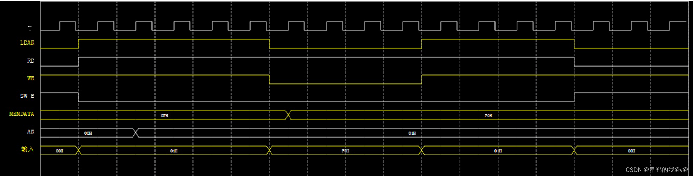

2.怎么查看某个地址的数据，先将数据传入地址寄存器，发出读信号给MEM，程序会显示地址中的数据。  通过时序图观察信号是否传入。

3.Cache实验操作解析:实验数据已经烧录到各个模块 比如00000000地址存放的是00010001，可以通过下图来查看:

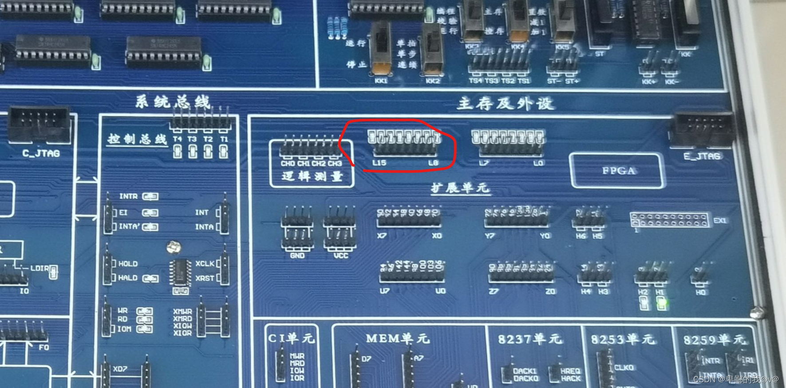

4.Cache实验按下KK1地址是加多少，这个如果能看到地址对应的数据就好了，我觉得是增加1，给出0000 0000Cahe没有说明cache没有命中，发现没有的时候Cache没有的时候已经去主存里查了，这三块数据写入缓存三次，当读入第四次的时候，发现H2灯灭，这时向地址线分别发送0000 0001（0、1、2、3）发现都能看到数据并且H2灯灭，说明这四块都调入了Cache并且被命中。

5.时钟的作用是把主存的四个块都送入Cache里，其实都是一个周期，只不过实验把步骤拆解了，L7-L0是显示缓存送往Cpu的数据，第4步体现的程序的局部性原理。

6.关于电路图我不是很明白，希望有大哥可以交流交流。

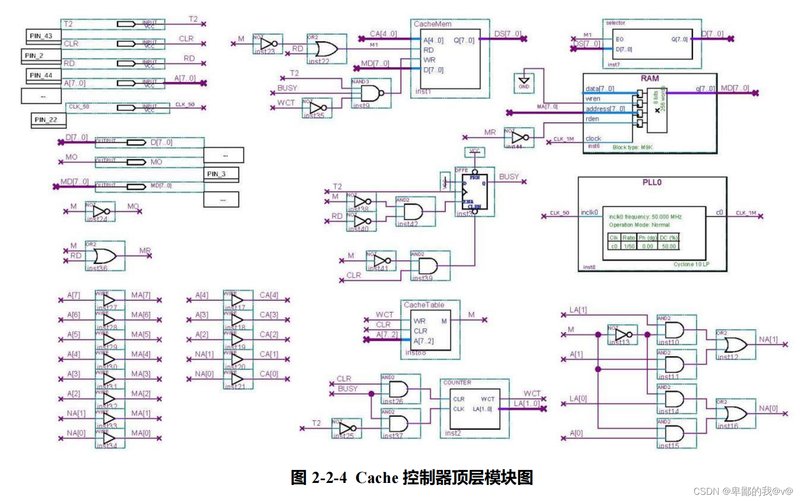

 先用busy信号和清零信号产生一个wct,另一端给出地址A7-A2,wct在找命不命中.

7.一些思考：既然都有局部性原理为什么不在访问1地址不命中的时候，做出预判直接把2块送入主存

8.关于存储器访问

第二个实验，在CacheCtrl.hex查看主的内容 对于实验台SD17-SD10

从左向右3位区号 3位块号 两位块内地址  11 22..分别表示一个字 0001 0001 0010 0010

注意地址和块内地址都是从0开始的 无论从块内的哪一个地址开始，根据程序的局部性原理都是以块的形式来导入，导入之后可以通过查看块内地址查看数据

为啥L15-L8和L7-L0数据不一样，命中之后CPU和CACHE之间就建立了一个映射关系，不关主存的事了。 

9.线不要插反，否则读取数据也是反的，并且不要漏线。

10.另外一个博主写的很好，[计算机组成原理\_dweblover的博客-CSDN博客](https://blog.csdn.net/dweblover/category_8972692.html?spm=1001.2014.3001.5482 "计算机组成原理_dweblover的博客-CSDN博客")

 
-

本文转自 <https://blog.csdn.net/qq_62260432/article/details/136342911>，如有侵权，请联系删除。