 

总线是计算机中连接各个功能部件的纽带，是计算机各部件之间进行信息传输的公共通路。

总线不只是一组简单的信号传输线，它还是一组协议。他有两大特征 

*    分时:  同一总线在同一时刻，只能有一个部件占领总线发送信息，其他部件要发送信息得在该
    
    部件发送完释放总线后才能申请使用。
    
*   共享:在总线上可以挂接多个部件，它们都可以使用这一信息通路来和其他部件传送信息。
    

总线结构是决定[计算机性能](https://so.csdn.net/so/search?q=%E8%AE%A1%E7%AE%97%E6%9C%BA%E6%80%A7%E8%83%BD&spm=1001.2101.3001.7020)、功能、可扩展性和标准化程度的重要因素。

**一、实验目的**
--------------

1.  理解总线的概念及其特性。
2.  掌握控制总线的功能和应用。
3.  理解总线的功能和和典型工作流程。
4.  掌握在总线上协调ALU和外设交换数据的方法。

**二、实验预习**
------------------

### 1、阅读实验指导书，然后回答问题。

本实验所使用的系统总线可分为（**地址总线**）、（**控制总线**）和（**数据总线**），分别提供存  储器和输入/输出设备所需的信号及数据通路。其中，总线上各个设备的片选信号由(**地址**)总线的高位通过74LS139芯片译码后获得。系统总线和[CPU](https://so.csdn.net/so/search?q=CPU&spm=1001.2101.3001.7020)内部总线之间通过（**三态门**）连接，同时实现了内外总线的分离和对于数据流向的控制。为了区分对主存和外设  的读写操作，还需要一个（**读写控制**）逻辑，使得 CPU 能按需区分对 MEM 和I/O 设备的读写。LDAR的作用是是否将数据写入地址寄存器

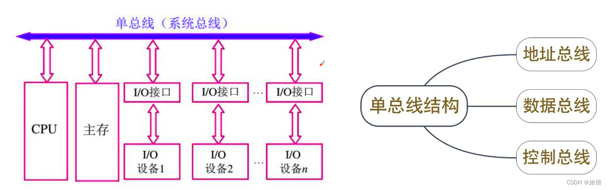

单总线不是一个线，是一套设备。 

### 2.根据 74LS139 双译码器集成电路的管脚图回答问题。

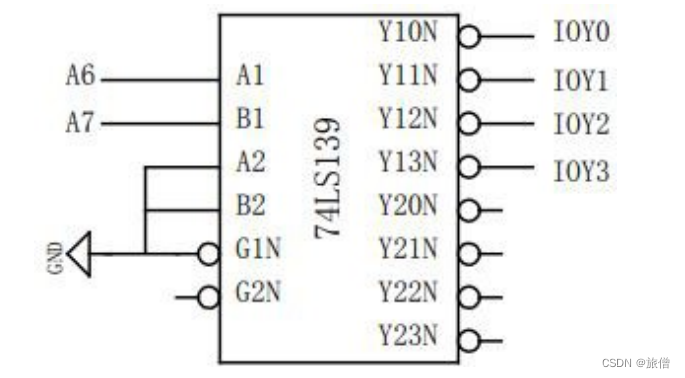

1.  )  输出Y10N~Y13N对应的信号输入端是：（A1 B1）
2.  )  输出Y10N~Y13N对应的使能端是：（G1N）
3.  )  输出Y20N~Y23N对应的信号输入端是：（A2 B2）
4.  )  输出Y20N~Y23N对应的使能端是：（G2N）
5.  )  已知该芯片悬空的输入端等同于高电平，则Y20N应输出（0/1）：（1）
6.  )  G1N引脚接地的目的是：（低电平有效,为使Y10N~Y13N工作）

### 3、根据读写控制逻辑的原理图，回答下列问题。

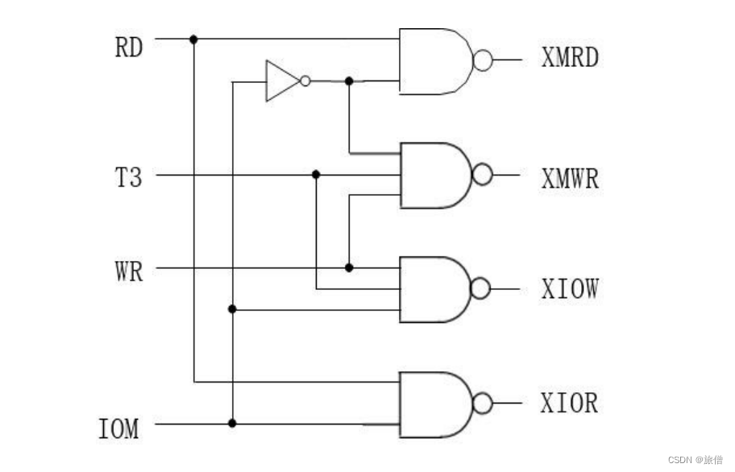

（1）当CPU读取主存时，RD、IOM信号分别为（0/1）：**（1 0）**

此时送往主存的控制信号XMRD和XMWR分别为（0/1）：**（0 1）**

（2）当CPU写入I/O设备时，WR、IOM信号分别为（0/1）：**（1 1）**

此时送往I/O设备的控制信号XIOW和XIOR分别为（0/1）：**（0 1）**

（3）信号T3的来源和作用是：（**来源：T3由时序单元的Ts3给出 作用：保证脉宽与T3一致**）

### 4、根据总线传输实验框图，回答下列问题。          

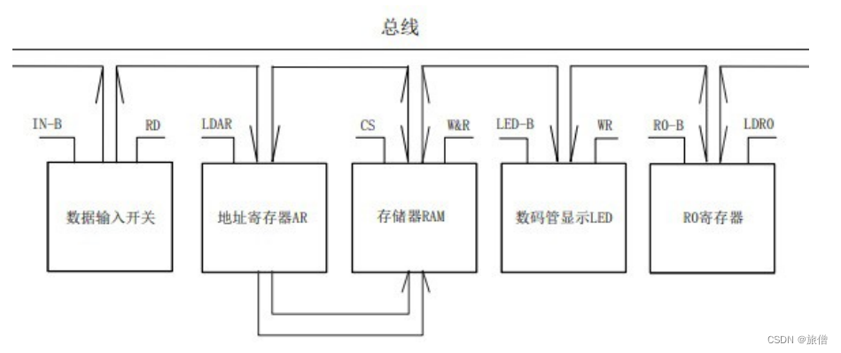

   写出从总线的视角看，与其相连的各设备的信息传输方向。

(1）数据输入开关的信息传输方向（输入/输出/双向）：（**输入**）

(2）地址寄存器的信息传输方向（输入/输出/双向）：（**输出**)

(3）存储器的信息传输方向（输入/输出/双向）：（**双向**）

（4）数码管的信息传输方向（输入/输出/双向）：（**输出**）

（5）寄存器R0的信息传输方向（输入/输出/双向）：（**双向**）

### 5.将IN单元的输入数据写入存储器的过程中用到了哪个寄存器？为什么要用寄存器作为数据暂存？ 

用到A寄存器,因为IN单元和数据寄存器，数据寄存器和数据总线有数据通路，可以进行数据交换，而计算机现有的硬件逻辑不支持CPU直接读取IO设备中的内容。

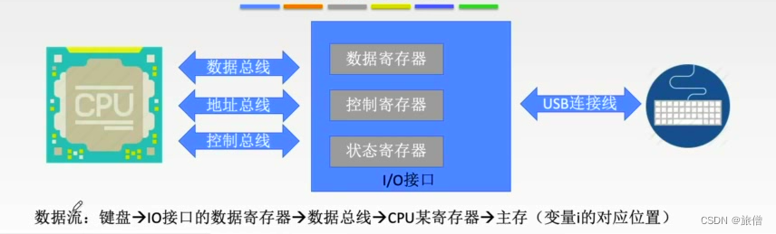

###  6、结合3.2的实验操作步骤，分析单总线计算机系统的优缺点

**单总线结构：CPU、主存、I/O设备都连接在一组总线上，允许I/O设备之间、I/O设备和CPU之间或I/O设备与主存之间直接交换信息**

*   **优点**：**结构简单**、**成本低**、**易于接入新的设备**
*   **缺点**：**带宽低、负载重、多个部件只能争用唯一的总线**，且**不支持并行操作**；另外像CPU、主存它们的速度是很快的，但是像硬盘这些设备速度要很慢，所以这种方式也不科学

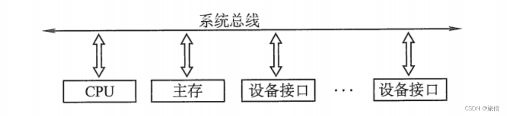

实验操作
----

### 1.读写逻辑设计实验

#### 操作

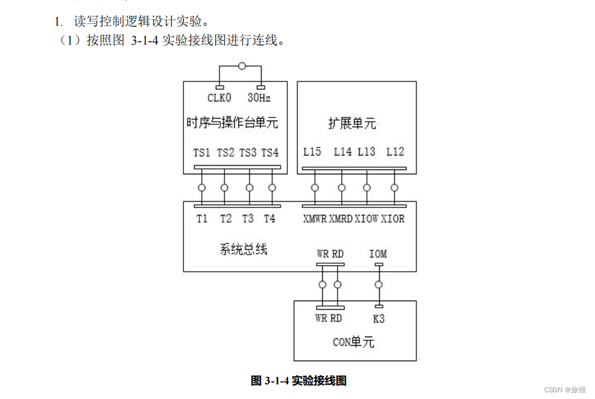

首先将时序与操作台单元的开关 KK1、KK3 置为“运行”档，开关 KK2 置为“单拍”档，

按动 CON 单元的总清按钮 CLR，并执行下述操作。

**① 对 MEM 进行读操作**（WR=0，RD=1，IOM=0),此时 **L14** 灭,表示存储器读功能信号有效。

**② 对 MEM 进行写操作**（WR=1，RD=0，IOM=0），连续按动开关 ST，观察扩展单元数据

指示灯，指示灯显示为 T3 时刻时，L15 灭,表示存储器写功能信号有效。

**③ 对 I/O 进行读操作**（WR=0，RD=1，IOM=1），此时 L12 灭，表示 I/O 读功能信号有效。

**④ 对 I/O 进行写操作**（WR=1，RD=0，IOM=1），连续按动开关 ST，观察扩展单元数据指

示灯，指示灯显示为 T3 时刻时，L13 灭，表示 I/O 写功能信号有效。

### 2\. 基本输入输出功能的总线接口实验。

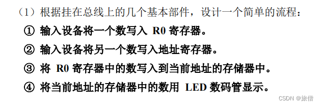

(2)连线

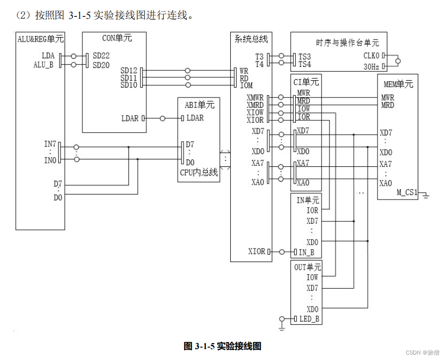

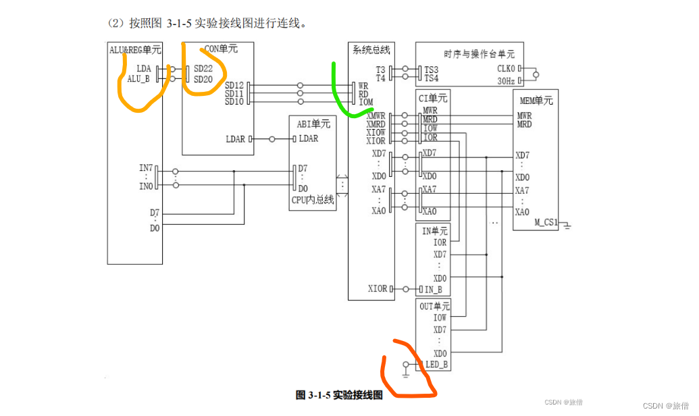

连线时需要注意的一些问题: 

红色部分接地需要连接GNU，橙色部分可以全连,绿色部分连的时候一定要漏一根针，因为他是二选一结构，否则会出现总线占用  

 （3）具体操作步骤如下：

*   进入软件界面，选择菜单命令“【实验】—【简单模型机】”，打开简单模型机实验数据通路图。
*   将时序与操作台单元的开关 KK1、KK3 置为“运行”档，开关 KK2 置为“单拍”档，CON 单元所有开关置 0（由于总线有总线竞争报警功能，在操作中应当先关闭应关闭的输出开关，再打开 应打开的输出开关，否则可能由于总线竞争导致实验出错）， 按动 CON 单元的总清按CLR，
*   然后按下面的顺序操作，在数据通路图中观测结果。

**① 输入设备将 11H 写入 A 寄存器。**

*   将 ALU\_B 置为 1，关闭 A 寄存器的输出；
*   WR、RD、IOM 分别置为 0、1、1，对 IN 单元进行读操作；
*   IN 单元置 00010001，LDA 置为 1，打开 A 寄存器的输入；
*   LDAR 置为 0， 不将数据总线的数写入地址寄存器。
*   连续四次点击图形界面上的“单节拍运行”按扭（运行一个机器周期），观察图形界面，在 T4 时刻完成对寄存器 A 的写入操作。

**② 将 A 中的数据 11H 写入存储器 01H 单元。**

*   将 ALU\_B 置为 1，关闭 A 寄存器的输出；
*   WR、RD、IOM 分别置为 0、1、1，对 IN 单元进行读操作。
*   LDA 置为 0，关闭 A 寄存器的输入；IN 单元置 00000001（或其他数值）。
*   LDAR 置为 1，将数据总线的数写入地址寄存器。
*   连续四次点击图形界面上的“单节拍运行”按扭，观察图形界面，在 T3 时刻完成对地址寄存器的写入操作。

**③ 将当前地址的存储器中的数写入到 A 寄存器中。**

*   将 ALU\_B 置为 1，关闭 A 寄存器的输出；
*   WR、RD、IOM 分别置为 0、1、1，对 IN 单元 进行读操作；
*   LDA 置为 0，关闭 A 寄存器的输入；IN 单元置 00000001（或其他数值）。
*   LDAR 置 为 1，将数据总线的数写入地址寄存器。
*   连续四次点击图形界面上的“单节拍运行” 按扭，观察图形界面，在 T3 时刻完成对地址寄存器的写入操作。

*   ALU\_B 置为 1，关闭 A 寄存器的输出；将 LDAR 置为 0，不将数据总线的数写入地址寄存 器；
*   WR、RD、IOM 分别置为 0、1、0，对存储器进行读操作；
*   LDA 置为 1，打开 A 寄存器的输 入。
*   连续四次点击图形界面上的“单节拍运行”按扭，观察图形界面，在 T4 时刻完成对 A 寄存器的写入操作。

**④ 将 A 寄存器中的数送往 LED 数码管进行显示。**

*   先将 LDA 置为 0，关闭 A 寄存器的输入；
*   LDAR 置为 0，不将数据总线的数写入地址寄存 器；
*   WR、RD、IOM 分别置为 1、0、1，对 OUT 单元进行写操作；再将 ALU\_B 置为 0，打开 A 寄存器的输出。
*   连续四次点击图形界面上的“单节拍运行”按扭，观察图形界面，在 T3 时刻完成对 OUT 单元的写入操作

#### 实验原始记录

  按实验连接图完成试验箱连线，打开 TDX-CMX 软件，选择联机软件界面中的“【实验】—【简单模型机】”，打开简单模型机实验数据通路图。

点击时序图按钮，打开选择观察信号窗口，或者选择联机软件的“【调试】-【时序观测图】”，选择想要观察的信号并点击确定。

#### **（一）本机运行**

1、验证读写控制逻辑的功能。

表 3-1 验证读写控制逻辑实验结果

<table border="1" cellspacing="0"><tbody><tr><td>
操作步骤
</td><td colspan="7">
控制信号状态（用&nbsp;0/1&nbsp;表示）
</td></tr><tr><td rowspan="2">
&nbsp;

对 MEM&nbsp;进行读操作
</td><td>
WR
</td><td>
RD
</td><td>
IOM
</td><td>
L12
</td><td>
L13
</td><td>
L14
</td><td>
L15
</td></tr><tr><td>
0
</td><td>
1
</td><td>
0
</td><td>
1
</td><td>
1
</td><td>
0
</td><td>
1
</td></tr><tr><td rowspan="2">
&nbsp;

对 MEM&nbsp;进行写操作
</td><td>
WR
</td><td>
RD
</td><td>
IOM
</td><td>
L12
</td><td>
L13
</td><td>
L14
</td><td>
L15
</td></tr><tr><td>
1
</td><td>
0
</td><td>
0
</td><td>
1
</td><td>
1
</td><td>
1
</td><td>
0
</td></tr><tr><td rowspan="2">
&nbsp;

对 I/O&nbsp;进行读操作
</td><td>
WR
</td><td>
RD
</td><td>
IOM
</td><td>
L12
</td><td>
L13
</td><td>
L14
</td><td>
L15
</td></tr><tr><td>
0
</td><td>
1
</td><td>
1
</td><td>
0
</td><td>
1
</td><td>
1
</td><td>
1
</td></tr><tr><td rowspan="2">
&nbsp;

对 I/O&nbsp;进行写操作
</td><td>
WR
</td><td>
RD
</td><td>
IOM
</td><td>
L12
</td><td>
L13
</td><td>
L14
</td><td>
L15
</td></tr><tr><td>
1
</td><td>
0
</td><td>
1
</td><td>
1
</td><td>
1
</td><td>
1
</td><td>
1
</td></tr></tbody></table>

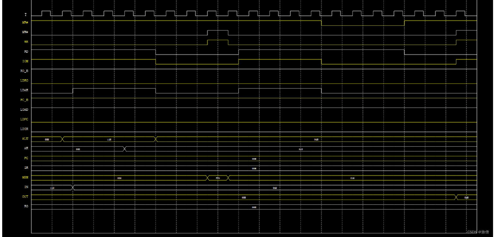

2、基本输入输出功能的总线接口实验（数据和地址自定义）。

表 3-2 简单总线操作流程实验结果

<table border="1" cellspacing="0"><tbody><tr><td colspan="2">
操作步骤
</td><td colspan="4">
控制信号状态（用&nbsp;0/1&nbsp;表示）
</td></tr><tr><td rowspan="2">
&nbsp;

输入数据写入&nbsp;R0
</td><td>
数据信息
</td><td>
IN-B
</td><td>
RD
</td><td>
R0-B
</td><td>
LDR0
</td></tr><tr><td>
00010001
</td><td>
0
</td><td>
1
</td><td>
1
</td><td>
0
</td></tr><tr><td rowspan="2">
&nbsp;

输入地址写入&nbsp;AR
</td><td>
地址信息
</td><td>
IN-B
</td><td>
RD
</td><td>
CS
</td><td>
LDAR
</td></tr><tr><td>
00000001
</td><td>
0
</td><td>
1
</td><td>
0
</td><td>
1
</td></tr><tr><td colspan="2" rowspan="2">
&nbsp;

R0&nbsp;数据写入存储器当前地址
</td><td>
R0-B
</td><td>
LDR0
</td><td>
CS
</td><td>
W&amp;R
</td></tr><tr><td>
1
</td><td>
0
</td><td>
0
</td><td>
1
</td></tr><tr><td colspan="2" rowspan="2">
在 LED 数码管上显示存储器当前地址的数据
</td><td>
CS
</td><td>
W&amp;R
</td><td>
LED-B
</td><td>
WR
</td></tr><tr><td>
0
</td><td>
0
</td><td>
0
</td><td>
1
</td></tr></tbody></table>

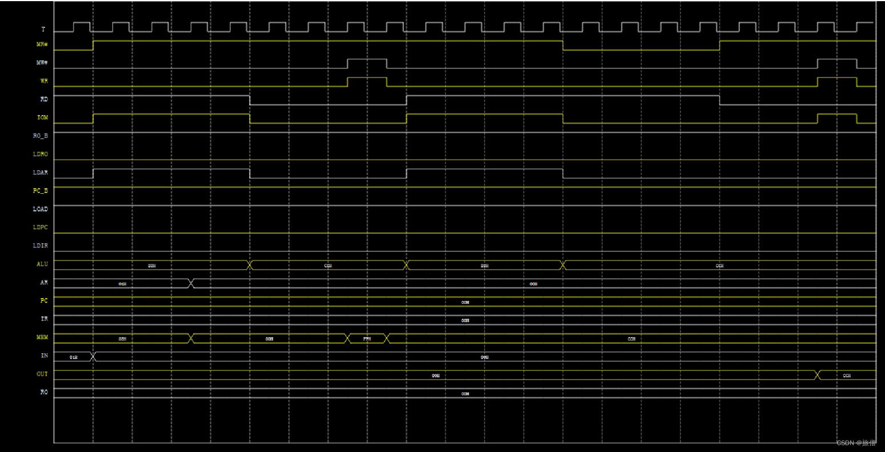

**实验思考题**
-------------------

### 1.简述存储器与I/O端口统一编址和独立编址的区别，并判断图3-1-5中的模型机属于何种编址方式？并说明理由。

**统一编址：又称存储器映射方式，是把I/O端口当作存储器的单元进行地址分配，这种方式CPU不需要设置专门的I/O指令，用统一的访存指令就可以访问I/O端口**

**独立编址：又称I/O映射方式，I/O端口的地址空间与主存地址空间是两个独立的地址空间，因而无法从地址码的形式上区分，需要设置专门的I/O指令来访问I/O端口**

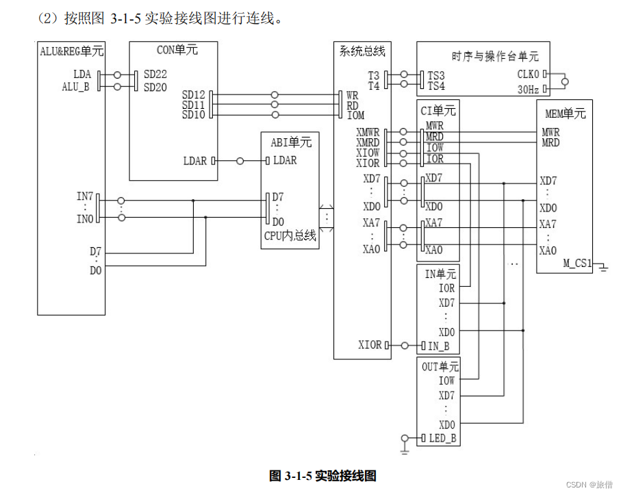

 **属于独立编址，因为有专门的IO指令**

### **2****.**在3.2实验中，如果ALU的运算结果为外部设备所需的数据，且不需要保存到存储器中，能否不经过存储器而将其直接送往外设（OUT单元的数码管）？如能，请简述操作过程；否则说明为什么。

可以直接将其送往外设，因为ALU和外设之间有一条数据通路 操作过程置alu\_b为0，iow为1，wr为1，四个节拍即写入IO。在ALU中计算得到结果后，先将LDA置为0，关闭A寄存器的输入；LDAR置为0， 不将数据总线的数写入地址寄存器；WR、RD、IOM分别置为1、0、1，对OUT单 元进行写操作；再将ALU\_B置为0，打开A寄存器的输出。连续四次点击图形界面上的 “单节拍运行”按扭，在T3时刻完成对OUT单元的写入操作，此时OUT单元的结果就是ALU的计算结果。

### 3.本实验OUT单元的LED\_B的作用是什么，为什么将其恒接地？

OUT单元LED\_B作用是数码管有效信号，低电平有效所以恒接地。

本文转自 <https://blog.csdn.net/qq_62260432/article/details/136343011>，如有侵权，请联系删除。