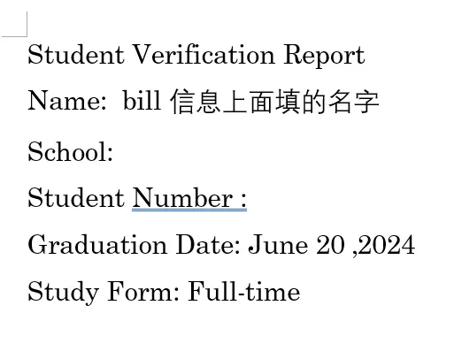
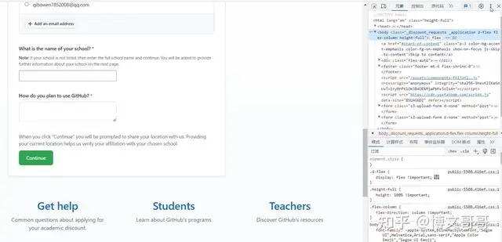
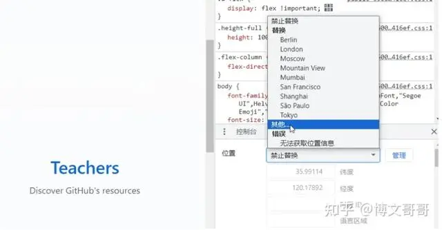
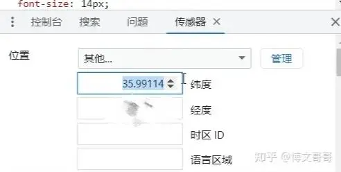

# Github教育资格申请速通

之前申了几次都被拒了，查了下终于被Approved

参考：

https://zhuanlan.zhihu.com/p/680183817

https://baijiahao.baidu.com/s?id=1797939178831168025&wfr=spider&for=pc

## 重点

* Github设置界面有Billing选项，要在里面填你的真实姓名和地址

* **要开2FA**，提高账户安全等级，后面才容易通过，具体怎么开直接百度很简单

* 交学生证那一步，其实不需要拍学信网的那个证明，不然还要转成英文很麻烦。因为Github认证是OCR，只认识字，所以用word写一份直接截图提交就行。

* **要关梯子，不然定位不准。**

* 有时候电脑端读不到定位会导致第一步点击`Continue`没反应，因为他在反复尝试读你的GPS数据。解决方法很简单：

打开[http://jingweidu.757dy.com/](http://jingweidu.757dy.com/)，查询自己位置的经纬度

在continue界面按下F12（也有可能是Fn+F12）打开开发者模式，找到右上角三个点

在弹出的菜单中找到`更多工具`-`传感器`

在下面弹出界面找到位置，点开`禁止替换`的组合框，选择其他

把第一步查询的经纬度粘贴上

点击`continue`试试，立刻就开始加载了
