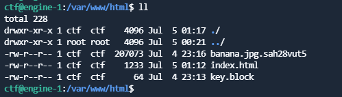
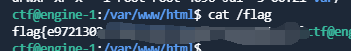
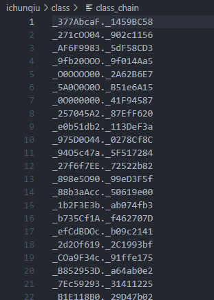
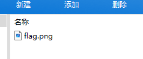
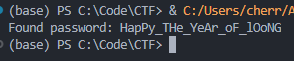
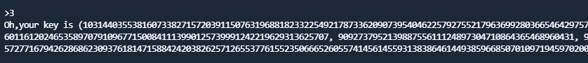
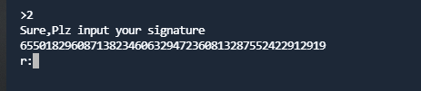
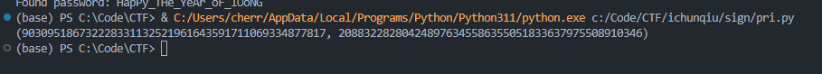
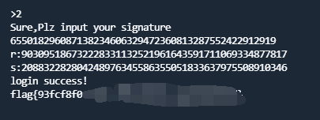
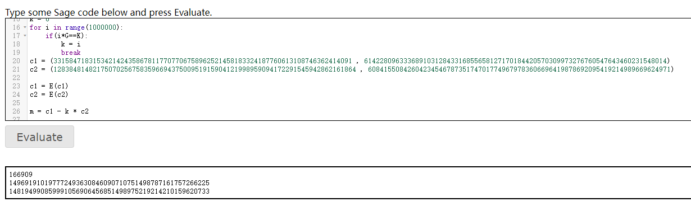

# 春秋杯夏季赛WriteUp

*白日梦主义 | 2024.07.06*

**做了勒索病毒，class，Signature，ezzzecc的题目**

## 勒索病毒

BlackBasta勒索病毒，在[https://www.nomoreransom.org/zh/decryption-tools.html](https://www.nomoreransom.org/zh/decryption-tools.html)获取解密工具



banana应该是被加密的文件。将解密工具上传，按照公众号提示代码即可解密

```shell
sed -i 's/flags/"flags"/' ./decryptblocks.py
export SRL_IGNORE_MAGIC=1
./decryptblocks.py ./banana.jpg.sah28vut5 ./key.block
```

要注意的就是要将文件后缀改回jpg，才能被系统检测到


可以看到/flag已经变为可读权限


获取得到flag



## class

下载附件，里面巨多的class，一共11463个

从os.system向上统计利用链

```python
	# 初始化字典
	classes = {}
	caller_map = {}
	# 读取文件并解析类和函数信息
	with open("./class", "r") as f:
	   # 跳过前三行
	   next(f)
	   next(f)
	   next(f)
	   # 逐行读取剩余的内容
	   for line1 in iter(lambda: f.readline(), ''):
	       # 提取类名和函数名
	       class_name = line1.split("class ")[1].split("():")[0]
	       func_name = next(f).split("def ")[1].split("(self):")[0]
	       # 检查类名是否唯一
	       if class_name in classes:
	           raise ValueError(f"duplicate class: {class_name}")
	       classes[class_name] = func_name
	       # 检查条件是否为真
	       cond = next(f).split("if ")[1].split(":")[0]
	       if not eval(cond):
	           raise ValueError(f"condition not true: {class_name}")
	       # 读取调用函数的名称
	       callee = next(f).strip().split("(")[0]
	       caller_map[callee] = f"{class_name}.{func_name}"
	       # 跳过接下来的两行
	       next(f)
	       next(f)
	# 初始化追踪变量和字符串
	cur = "os.system"
	class_str = ""
	func_str = ""
	all_str = ""
	cnt = 0
	# 追踪函数调用链
	while cur in caller_map:
	   cur = caller_map[cur]
	   class_str += cur.split(".")[0]
	   func_str += cur.split(".")[1]
	   cnt += 1
	   all_str += cur.replace(".", "")
	# 输出结果
	print(cnt)
	letters = set(all_str)
	print("".join(sorted(letters)))
```



输出的所有类名包括的字符有0123456789ABCDEFO，考虑可能是将大写字母O替换为数字0
```python
class_str = class_str.replace("O", "0")
func_str = func_str.replace("O", "0")
all_str = all_str.replace("O", "0")
```

发现文本类似于7z文件的文件头，将类名和函数名拼接写入7z文件。尝试解压，发现flag.png，成功




## Signature

首先分析server.py，就是标准的DSA签名算法

给了8次生成签名的机会，一开始还以为是根据这8次的结果进行共模攻击爆出私钥，后来发现私钥居然直接给了

那就很好办了，首先看第一步拦住的gift部分

```python
def gen_proof_key():
    password = 'happy_the_year_of_loong'
    getin = ''
    for i in password:
        if random.randint(0, 1):
            getin += i.lower()
        else:
            getin += i.upper()
    ans = hashlib.sha256(getin.encode()).hexdigest()
    return getin, ans
```

gift就是密钥哈希的前六位，因为密钥就2^23的复杂度，直接嗯爆破就行

```python
import hashlib
from Crypto.Util.number import *

def find_password(prefix):
    password = 'happy_the_year_of_loong'
    for i in range(2 ** len(password)):
        binary = bin(i)[2:].zfill(len(password))
        guess = ''.join([password[j].lower() if binary[j] == '0' else password[j].upper() for j in range(len(password))])
        hashed = hashlib.sha256(guess.encode()).hexdigest()
        if hashed.startswith(prefix):
            return guess
    return None

prefix = 'd1283c'

password = find_password(prefix)
if password is not None:
    print(f'Found password: {password}')
else:
    print('Password not found.')
```


登陆进系统，首先选择3查看生成的DSA密钥



然后输入2，可以直接获得私钥pri



直接用原函数对admin用户进行签名即可

```python
import os
import hashlib
from Crypto.Util.number import *

def sign(m,pri):
    k = int(hashlib.md5(os.urandom(20)).hexdigest(),16)
    H = int(hashlib.sha256(m).hexdigest(),16)
    r = pow(g,k,p) % q
    s = pow(k,-1,q) * (H + pri * r) % q
    return r,s

p, q, g = (num_p,num_q,num_g)
pri=655018296087138234606329472360813287552422912919
name = 'admin'.encode()
text=sign(name,pri)
print(text)
```



登陆进系统，直接吐出flag了



## ezzzecc

按照题中要求，已知a、b、K、G，可以暴力算出私钥k，因为k小于1000000，在可穷举的范围内
```python
E = EllipticCurve(GF(p),[a,b])
K = E(K)
G = E(G)
k = 0
for i in range(1000000):
	if(i*G==K):
		k = i
		break
```
然后正常进行解密即可
```python
c1 = E(c1)
c2 = E(c2)

m = c1 - k * c2

print(cipher_left//m[0])
print(cipher_right//m[1])
```
计算得出私钥k和解密的明文


最后将两部分转码成ASCII码，即为flag的左右两部分，拼接得到flag{2d6a7e4e-02d3-11ef-8836-a4b1c1c5a2d2}