 
**4.1** **微程序控制器实验**
------------------------

### **一、实验目的**

(1) 掌握微程序控制器的组成原理。

(2) 掌握微程序的编制、写入，观察微程序的运行过程。

(3) 基于数据通路图，掌握微程序控制器的工作原理。

(4) 基于微[程序流程图](https://so.csdn.net/so/search?q=%E7%A8%8B%E5%BA%8F%E6%B5%81%E7%A8%8B%E5%9B%BE&spm=1001.2101.3001.7020)，掌握微程序控制器的工作原理。

(5) 基于信号[时序图](https://so.csdn.net/so/search?q=%E6%97%B6%E5%BA%8F%E5%9B%BE&spm=1001.2101.3001.7020)，掌握微程序控制器的工作原理

### 实验原理

1.  微程序控制器根本的任务是完成指令的翻译和执行，执行方法就是将指命令进行编码 并储存在控制存储器里。
2.  微程序控制器是时序逻辑严格的按照节拍来完成相应的操作，本实验用到的节拍是TS1-TS4.
3.  实验设有一组编程控制开关 （位于时序与操作台）可实现对存储器的编程校验和运行具体的使用方法如下:

#### 手动输入方法

**这一步 只是为了模拟一下输入的步骤 也可以直接文件导入**

eg:**向332211M(00H) 数据的写入操作  操作思路：分为中低高三路进行编程**

*   首先将 KK1 拨至‘停止’档、KK3 拨至‘编程’档、KK4 拨至‘控存’档、KK5 拨至‘置数’档
    
*   由 **CON 单元的 SD15——SD10** 开关给出需要编辑的**控存****单元首地址**（000000）
    
    IN 单元开关给出该控存单元数据的低 8 位（00010001）也就是11  
    连续**两次按动**时序与操作台单元的开关ST（一定要是两次）
    
    explain: 按动ST之后 (第一次按动后 [MC](https://so.csdn.net/so/search?q=MC&spm=1001.2101.3001.7020) 单元低 8 位显示该单元以前存储的数据，第二次按动后显示当前改动的数据），此时 MC 单元的指示灯 MA5——MA0 显示当前地址（000000），M7——M0 显示当前数据（00010001）。
    
    **输入:以下演示同上方低八位相同 但是一些小细节需要注意：被编辑的单元在三路都被修改之后控存单元CU会自动加一**
    
    1.  然后将KK5 拨至‘加1’档，IN 单元开关给出该控存单元数据的中8 位（00100010），
    2.  连续两次按动开关 ST，完成对该控存单元中 8 位数据的修改，此时 MC 单元的指示灯 MA5——MA0 显示当前地址（000000），M15——M8 显示当前数据（00100010）；
    3.  再由 IN 单元开关给出该控存单元数据的高 8 位（00110011），连续两次按动开关 ST，完成对该控存单元高 8 位数据的修改此时 MC 单元的指示灯 MA5——MA0 显示当前地址（000000），M23——M16 显示当前数据（00110011）。
    4.  此时被编辑的控存单元地址会自动加 1（01H），由 IN 单元开关依次给出该控存单元数据的低 8 位、中 8 位和高 8 位配合每次开关 ST 的两次按动，即可完成对后续单元的编辑。
    
    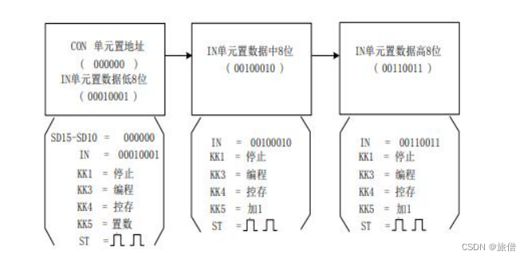
    
    **校验输入：**
    
    *   编辑完成后需进行校验，以确保编辑的正确。以校验 00H 单元为例，对于控制存储器进行校验的具体操作步骤如下：
    *   首先将 KK1 拨至‘停止’档、KK3 拨至‘校验’档、KK4 拨至‘控存’档、KK5 拨至‘置数’档。
    *   由 CON 单元的 SD15——SD10 开关给出需要校验的控存单元地址（000000），
    *   连续两次按动开关 ST，MC 单元指示灯 M7——M0 显示该单元低 8 位数据（00010001）；
    *   KK5 拨至‘加 1’档，再连续两次按动开关 ST，MC 单元指示灯 M15——M8 显示该单元中 8 位数据（00100010）；
    *   再连续两次按动开关 ST，MC 单元指示灯 M23——M16 显示该单元高 8 位数据（00110011）。
    *   再连续两次按动开关 ST，地址加 1，MC 单元指示灯 M7——M0 显示 01H 单元低 8 位数据。如校验的微指令出错，则返回输入操作，修改该单元的数据后再进行校验，直至确认输入的微代码全部准确无误为止，完成对微指令的输入。
    
    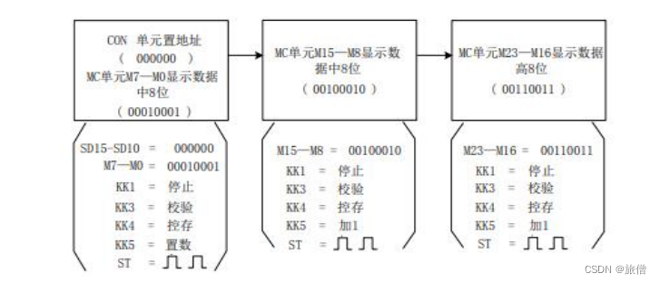
    
    **对字段进行平行操作**
    
    位于实验平台 MC 单元左上角一列三个指示灯 MC2、MC1、MC0 用来指示当前操作的微
    
    程序字段，分别对应 M23——M16、M15——M8、M7——M0。实验平台提供了比较灵活的
    
    手动操作方式，比如在上述操作中在对地址置数后将开关 KK4 拨至‘减 1’档，则每次随着开
    
    关ST 的两次拨动操作，字节数依次从高 8 位到低 8 位递减，减至低 8 位后，再按动两次开关
    
    ST，微地址会自动减一，继续对下一个单元的操作。
    
    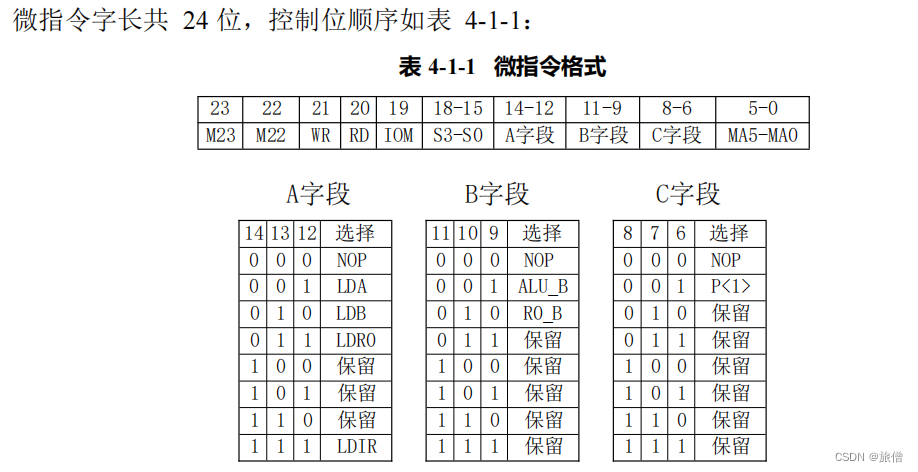
    
    #### 文件输入方法
    
    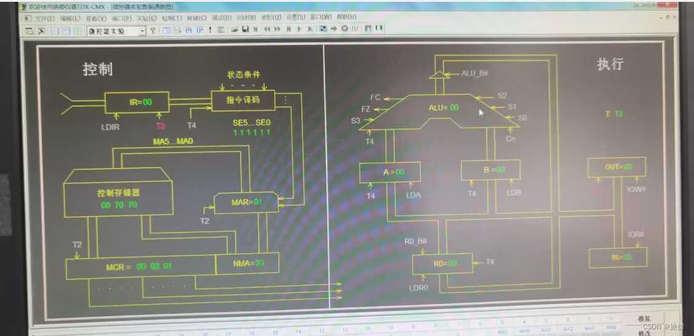
    
    转储->在sample中选择文件 
    

### **二、实验预习**

1、阅读实验指导书，然后回答问题。

(1) 微指令字长共 24 位，控制位顺序如表 4-1-1：

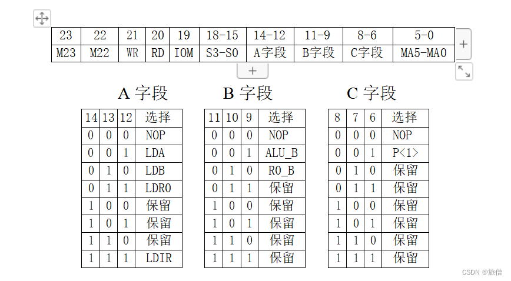

其中 MA5…MA0 为 6 位的（ **后续微地址**），A、B、C 为三个（**为三个译码字段** ），分别由三个控制位译码出多位。C 字段中的 P<1>为（**为测试字位** ）。其功能是根据机器指令及相应微代码进行译码，使微程序转入相应的（ **微地址入口**），从而实现完成对指令的识别，并实现微程序的分支。本系统上的 指令译码原理如图 4-1-3 所示，图中 I7…I2 为指令寄存器的第 7…2 位输出，SE5…SE0 为微控器单元微地址锁存器的强置端输出，指令译码逻辑在控制器单元的INS\_DEC 中实现。

个人感觉译码方式是直接译码，经过译码器的翻译编程控制信号

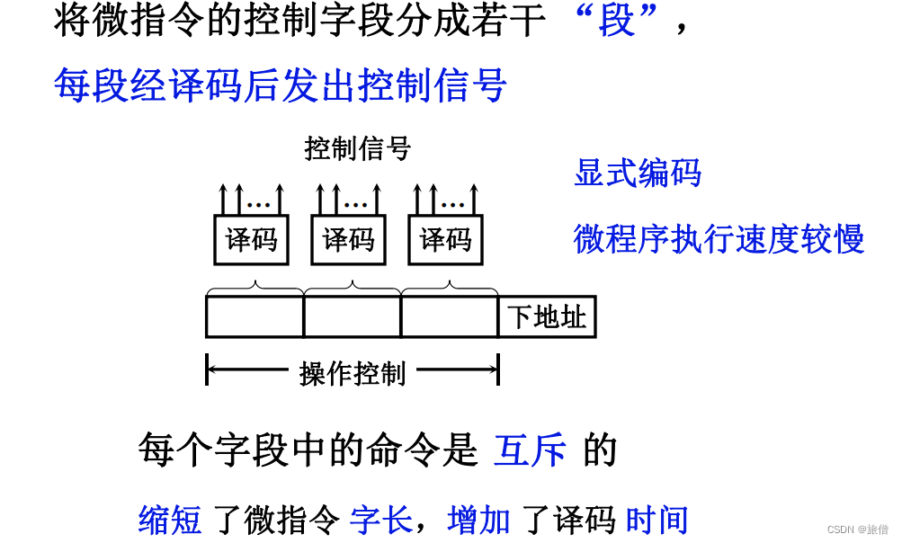

(2)本实验安排了四条机器指令，分别为 ADD（0000 0000）、IN（0010 0000）、 OUT（0011 0000）和 HLT（0101 0000）。  括号中为各指令的二进制代码，指令格式如下，请补充说明部分。                                       

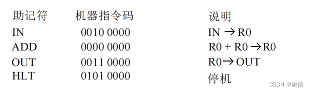

   实验中机器指令由 CON 单元的**二进制开关**手动给出，其余单元的控制信号均由**微程序控制器**自动产生，为此可以设计出相应的数据通路图，

*   图中一个矩形方框表示一条微指令,方框中的内容为该指令执行的微操作，
*   右上角的数字是该条指令的微地址，右下角的数字是该条指令的后续微地址，
*   所有微地址均用 16 进制表示。
*   向下的箭头指出了下一条要执行的指令。P<1>为测试字，根据条件使微程序产生分支。

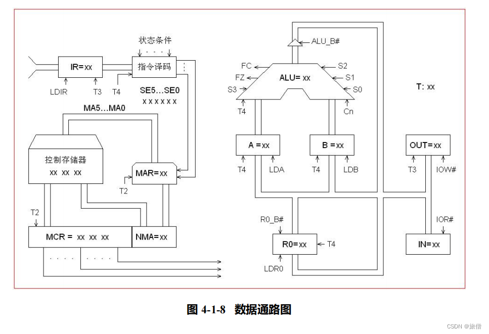

 实验步骤
-----

### 连线

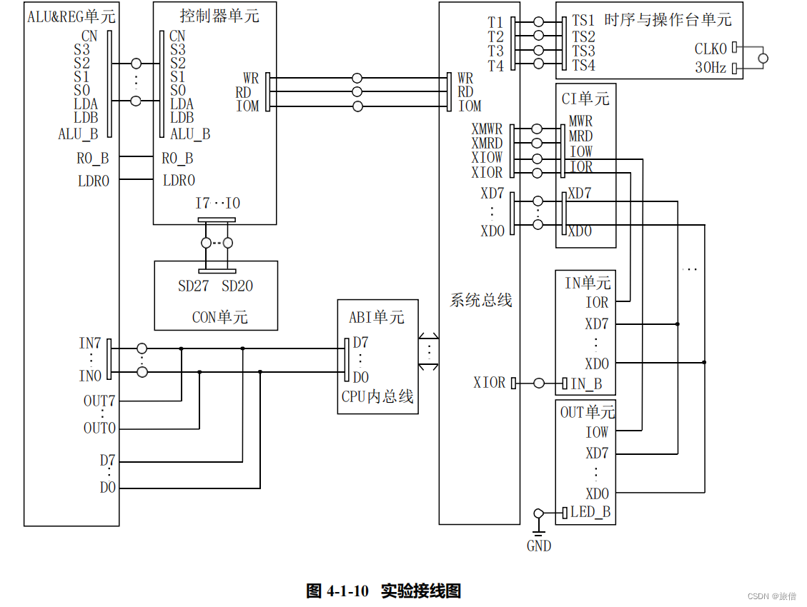

首先将指令输入，可以手动也可以导入文件，这里建议直接导入文件比较方便，按照指导书 的操作进行，可以选择单步或者单拍个人感觉单拍的效果比较好。

实验过程讲解和部分操作
-----------

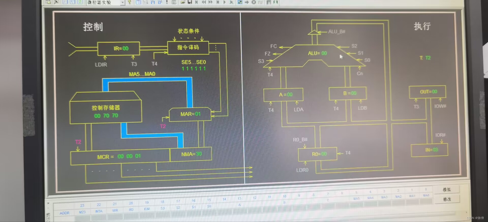

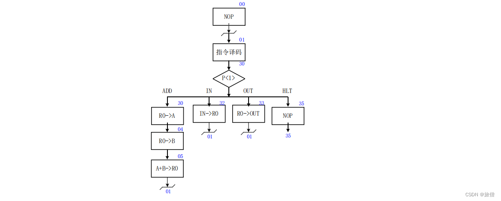

如上方流程图所示，首先 刷新电路 初始化 IR初始化为00 经过译码之后为30，单步运行是通过按ST按钮来形成的。

这里译码的原理大家可以简单查阅资料和查看电路来了解：这里就是进行了一个强转，将转换成MAR的01 进行一个分支判断，类似于一个for循环 ，此时需要等待用户输入指令，这里的指令在上方已经显示比如30是一个存数指令，每一条微指令执行完之后都会把下地址传送给CMAR，除了停机指令，下地址都是01回到循环判断的地方，在IN单元输入加数（如23H）要转换为二进制

*   首先输入32然后，在IN单元输入数据，多次按动ST直到观察到IN单元的数据传入R0单元并且节拍为T4的时候输入下一条指令， 此时下地址在CMAR显示01
*   输入30，看到R0分别把数据送到A B寄存器，并且经过ALU的运算最后的结果送给R0，并且T4的时刻等待用户输入下一条指令。 此时下地址在CMAR显示01
*   此时输入IR的值是33，将R0的值送到OUT显示，不断按动ST当发现OUT的值显示46，并且T4时候输入下条指令 此时下地址在CMAR显示01
*   输入35 直到下地址也是35 表示循环结束 不能进行跳转了 如果重新运行需要按动CLTR刷新电路。
*   最后jmp到00这个位置

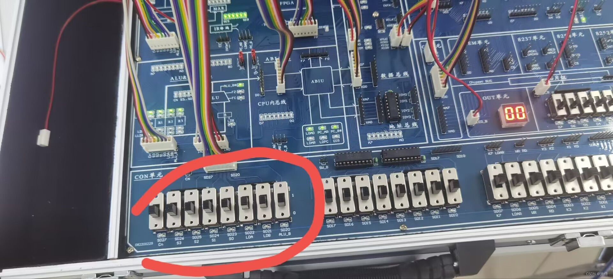

                                                                      IN输入位置 

译码的过程是一个电路屏蔽强转的过程。

查看sample文件可以找到微程序存储和主存储的对应关系

```cpp
//***** Start Of Main Memory Data *****// 这里是主存中的地址和对应的指令   $P 00 20    ; START: IN  R0   从IN单元读入数据送R0  $P 01 00    ; ADD R0,R0       R0和自身相加，结果送R0  $P 02 30    ; OUT R0          R0的值送OUT单元显示  $P 03 E0    ; JMP START       跳转至00H地址  $P 04 00    ;   $P 05 50    ; HLT             停机 ; //***** End Of Main Memory Data *****//  ; //** Start Of MicroController Data **//控存的地址和对应的指令   $M 00 000001    ; NOP  $M 01 006D43    ; PC->AR,PC加1  $M 03 107070    ; MEM->IR, P<1>  $M 04 002405    ; R0->B  $M 05 04B201    ; A加B->R0  $M 1D 105141    ; MEM->PC  $M 30 001404    ; R0->A   $M 32 183001    ; IN->R0   $M 33 280401    ; R0->OUT  $M 35 000035    ; NOP  $M 3C 006D5D    ; PC->AR,PC加1 ; //** End Of MicroController Data **//  
```

实验记录
----

**（一）本机运行**

1、按照实验指导书的步骤完成操作，并填写表格。

表4-1 程序运行过程

<table align="center" border="1" cellspacing="0"><tbody><tr><td rowspan="2"><p>机器指令</p></td><td rowspan="2"><p>机器</p><p>指令码</p></td><td colspan="9"><p>微指令</p></td></tr><tr><td><p>地址</p></td><td><p>下地址</p></td><td><p>高五位</p></td><td><p>S3-S0</p></td><td><p>A 字段</p></td><td colspan="2"><p>B 字段</p></td><td><p>C 字 段</p></td><td><p>MA5-MA0</p></td></tr><tr><td rowspan="3"><p>IN</p></td><td rowspan="3"><p>0010&nbsp;0000</p></td><td><p>00</p></td><td><p>000001</p></td><td><p>00000</p></td><td><p>0000</p></td><td><p>000</p></td><td><p>000</p></td><td colspan="2"><p>000</p></td><td><p>000001</p></td></tr><tr><td><p>01</p></td><td><p>110100</p></td><td><p>00000</p></td><td><p>0000</p></td><td><p>111</p></td><td><p>000</p></td><td colspan="2"><p>001</p></td><td><p>110000</p></td></tr><tr><td><p>32</p></td><td><p>000001</p></td><td><p>00011</p></td><td><p>0000</p></td><td><p>011</p></td><td><p>000</p></td><td colspan="2"><p>000</p></td><td><p>000001</p></td></tr><tr><td rowspan="4"><p>ADD</p></td><td rowspan="4"><p>0000&nbsp;0000</p></td><td><p>01</p></td><td><p>110000</p></td><td><p>00000</p></td><td><p>0000</p></td><td><p>111</p></td><td><p>000</p></td><td colspan="2"><p>001</p></td><td><p>110000</p></td></tr><tr><td><p>30</p></td><td><p>000100</p></td><td><p>00000</p></td><td><p>0000</p></td><td><p>001</p></td><td><p>010</p></td><td colspan="2"><p>000</p></td><td><p>000100</p></td></tr><tr><td><p>04</p></td><td><p>000101</p></td><td><p>00000</p></td><td><p>0000</p></td><td><p>010</p></td><td><p>010</p></td><td colspan="2"><p>000</p></td><td><p>000101</p></td></tr><tr><td><p>05</p></td><td><p>000001</p></td><td><p>00000</p></td><td><p>1001</p></td><td><p>011</p></td><td><p>001</p></td><td colspan="2"><p>000</p></td><td><p>000001</p></td></tr><tr><td rowspan="2"><p>OUT</p></td><td rowspan="2"><p>0011&nbsp;0000</p></td><td><p>01</p></td><td><p>110011</p></td><td><p>00000</p></td><td><p>0000</p></td><td><p>111</p></td><td><p>000</p></td><td colspan="2"><p>001</p></td><td><p>110000</p></td></tr><tr><td><p>33</p></td><td><p>0000001</p></td><td><p>00101</p></td><td><p>0000</p></td><td><p>000</p></td><td><p>010</p></td><td colspan="2"><p>000</p></td><td><p>000001</p></td></tr><tr><td rowspan="2"><p>HLT</p></td><td rowspan="2"><p>0101&nbsp;0000</p></td><td><p>01</p></td><td><p>110101</p></td><td><p>00000</p></td><td><p>0000</p></td><td><p>111</p></td><td><p>000</p></td><td colspan="2"><p>001</p></td><td><p>110000</p></td></tr><tr><td><p>35</p></td><td><p>110101</p></td><td><p>00000</p></td><td><p>0000</p></td><td><p>000</p></td><td><p>000</p></td><td colspan="2"><p>000</p></td><td><p>110101</p></td></tr></tbody></table>

通过IN单元输入的值为（00100011 ），运行结束后，通过OUT单元输出的值为（ 01000110）

**写出连续执行四条机器指令（IN-ADD-OUT-HLT）程序的每条微指令的下地址执行顺序**

000000→000001→（000000）→（000001）→（110000）→000001→（110010）→000001→（000001）→000001→（110000）

###  思考题：机器指令30H（即OUT指令）执行时，观察寄存器R0中的数据何时送入OUT单元？受哪些信号影响？

直接看时序图和数据流图：T3时刻上升沿送入OUT单位 受时钟信号、WR信号、IOM信号、R0\_B信号影响。

 **4.2  CPU 与简单模型机设计实验**
------------------------

### **一、实验目的**

  (1） 掌握一个简单 CPU 的组成原理。  
（2） 在掌握部件单元电路的基础上，进一步将其构造一台基本模型计算机。  
（3） 为其定义五条机器指令，编写相应的微程序，并上机调试掌握整机概念。

###   
**二.实验预习**

(1)实验4-2在4-1微程序控制器实验的基础上增加了三个部件，一是（PC ），另一个是（ AR ），还有就是 （MEM），因而在微指令中应增加相应的控制位，其微指令格式  如表4-2-1所示：

**表** **4-2-1 微指令格式**

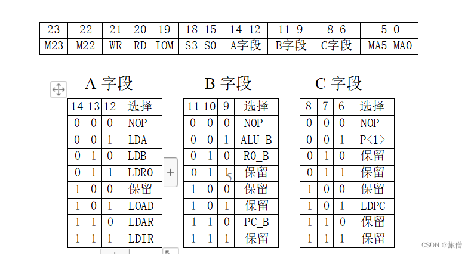

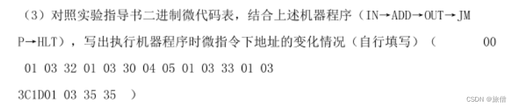

#### 2.简述微指令与4-1中微指令控制位有哪些不同？

A字段增加101 控制LOAD信号，用来控制主存  和110 控制LDAR信号 控制地址寄存器AR

B字段增加110 控制 PC\_B信号 控制PC输出

C字段增加101 控制LDPC信号 控制PC输入

实验过程类似第一个实验但是这个的指令不需要用户手动输入 是写入到程序中自动完成 冯诺伊曼的存储程序
-------------------------------------------------

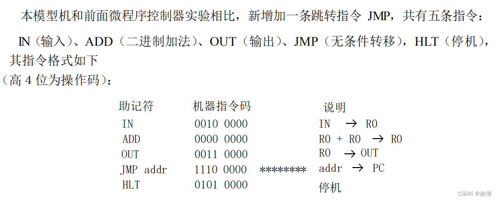

实验先选择响应的模型机并且导入数据，可以在查看->指令查看指令的地址，不断点击ST观察程序运行中的数据流情况，首先PC的值默认是00 然后+1，配合上方的流程图分析指令和数据以及机器是怎么配合的。

*   PC->MAR 1->R    传地址
*   PC+1=1 M(MAR)->IR(观察IR的变化)  取指令
*   OP(IR)->ID 译码 并传导信号 
*   AD(IR)->MAR 
*   M(MAR)->MDR->R0 
*   加法操作 此处的微操作省略 
*   将结果给R0并输出显示 实验就成功了

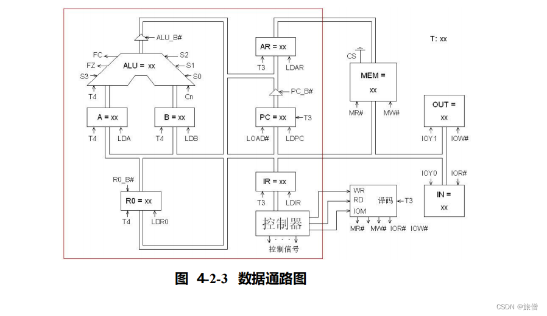

 此外 也可以点击右键观察数据流 按动ST 观察流动过程

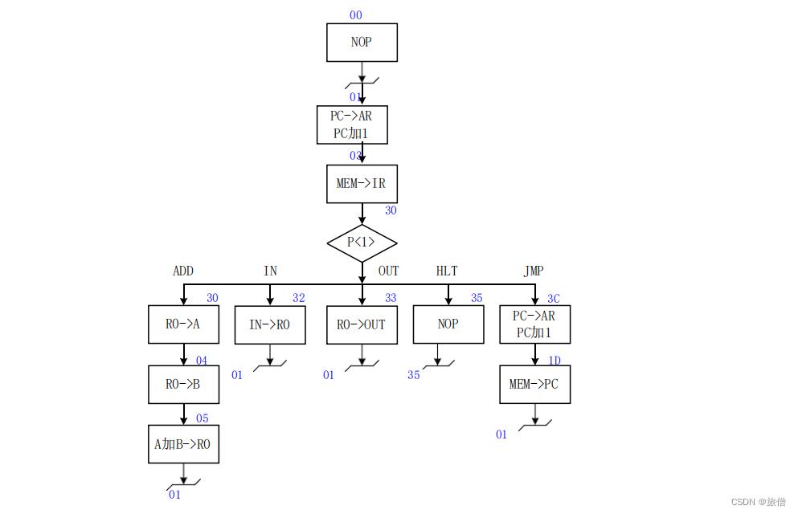

### **三.实验原始记录**

按照实验指导书的步骤完成操作，并填写表格。

表4-1 程序运行过程 这个图应该是对的更新一下 

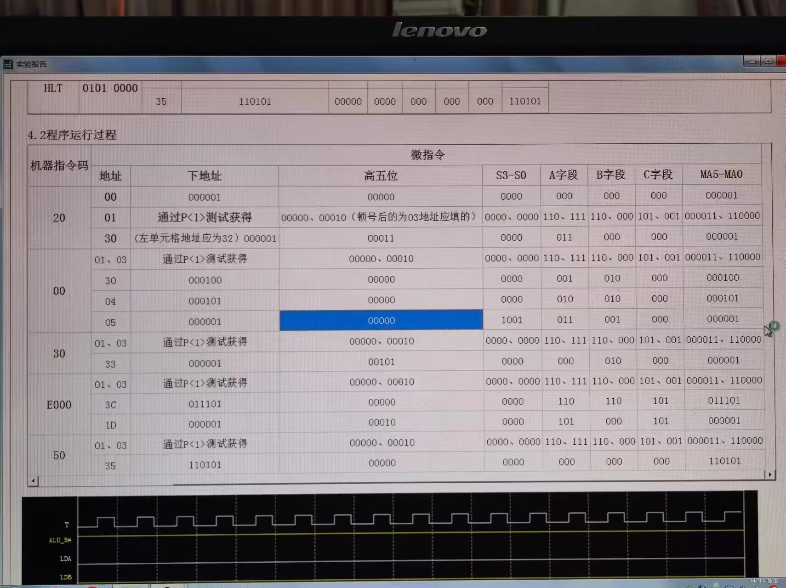

 **不要看下面的图**

<table align="center" border="1" cellspacing="0"><tbody><tr><td rowspan="2"><p>机器指令</p></td><td rowspan="2"><p>MEM地址</p></td><td rowspan="2"><p>机器</p><p>指令码</p></td><td colspan="8"><p>微指令</p></td></tr><tr><td><p>地址</p></td><td><p>下地址</p></td><td><p>高五位</p></td><td><p>S3-S0</p></td><td><p>A字段</p></td><td><p>B 字段</p></td><td><p>C 字 段</p></td><td><p>MA5-MA0</p></td></tr><tr><td rowspan="4"><p>IN</p></td><td rowspan="4"><p>00</p></td><td rowspan="4"><p>20</p></td><td><p>00</p></td><td><p>000001</p></td><td><p>00000</p></td><td><p>0000</p></td><td><p>000</p></td><td><p>000</p></td><td><p>000</p></td><td><p>000001</p></td></tr><tr><td><p>01</p></td><td><p>000011</p></td><td><p>00000</p></td><td><p>0000</p></td><td><p>110</p></td><td><p>000</p></td><td><p>101</p></td><td><p>000011</p></td></tr><tr><td><p>03</p></td><td><p>110010</p></td><td><p>00010</p></td><td><p>0000</p></td><td><p>111</p></td><td><p>000</p></td><td><p>001</p></td><td><p>110000</p></td></tr><tr><td><p>32</p></td><td><p>000001</p></td><td><p>00011</p></td><td><p>0000</p></td><td><p>011</p></td><td><p>000</p></td><td><p>000</p></td><td><p>000001</p></td></tr><tr><td rowspan="5"><p>ADD</p></td><td rowspan="5"><p>01</p></td><td rowspan="5"><p>00</p></td><td><p>01</p></td><td><p>000011</p></td><td><p>00000</p></td><td><p>0000</p></td><td><p>110</p></td><td><p>000</p></td><td><p>101</p></td><td><p>000011</p></td></tr><tr><td><p>03</p></td><td><p>110000</p></td><td><p>00010</p></td><td><p>0000</p></td><td><p>111</p></td><td><p>000</p></td><td><p>001</p></td><td><p>110000</p></td></tr><tr><td><p>30</p></td><td><p>000100</p></td><td><p>00000</p></td><td><p>0000</p></td><td><p>001</p></td><td><p>010</p></td><td><p>000</p></td><td><p>000100</p></td></tr><tr><td><p>04</p></td><td><p>000101</p></td><td><p>00000</p></td><td><p>0000</p></td><td><p>010</p></td><td><p>010</p></td><td><p>000</p></td><td><p>000101</p></td></tr><tr><td><p>05</p></td><td><p>000001</p></td><td><p>00000</p></td><td><p>1001</p></td><td><p>011</p></td><td><p>001</p></td><td><p>000</p></td><td><p>000001</p></td></tr><tr><td rowspan="3"><p>OUT</p></td><td rowspan="3"><p>02</p></td><td rowspan="3"><p>30</p></td><td><p>01</p></td><td><p>000011</p></td><td><p>00000</p></td><td><p>0000</p></td><td><p>110</p></td><td><p>000</p></td><td><p>101</p></td><td><p>000011</p></td></tr><tr><td><p>03</p></td><td><p>110011</p></td><td><p>00010</p></td><td><p>0000</p></td><td><p>111</p></td><td><p>000</p></td><td><p>001</p></td><td><p>110000</p></td></tr><tr><td><p>33</p></td><td><p>000001</p></td><td><p>00101</p></td><td><p>0000</p></td><td><p>000</p></td><td><p>010</p></td><td><p>000</p></td><td><p>000001</p></td></tr><tr><td rowspan="4"><p>JMP</p><p><em>addr</em></p></td><td rowspan="4"><p>03</p><p>04</p></td><td rowspan="4"><p>E0</p><p>00</p></td><td><p>01</p></td><td><p>000011</p></td><td><p>00000</p></td><td><p>0000</p></td><td><p>110</p></td><td><p>000</p></td><td><p>101</p></td><td><p>000011</p></td></tr><tr><td><p>03</p></td><td><p>111100</p></td><td><p>00010</p></td><td><p>0000</p></td><td><p>111</p></td><td><p>000</p></td><td><p>001</p></td><td><p>110000</p></td></tr><tr><td><p>3C</p></td><td><p>011101</p></td><td><p>00000</p></td><td><p>0000</p></td><td><p>110</p></td><td><p>110</p></td><td><p>101</p></td><td><p>011101</p></td></tr><tr><td><p>1D</p></td><td><p>000001</p></td><td><p>00000</p></td><td><p>0000</p></td><td><p>101</p></td><td><p>000</p></td><td><p>101</p></td><td><p>000001</p></td></tr><tr><td rowspan="3"><p>HLT</p></td><td rowspan="3"><p>05</p></td><td rowspan="3"><p>50</p></td><td><p>01</p></td><td><p>000011</p></td><td><p>00000</p></td><td><p>0000</p></td><td><p>110</p></td><td><p>000</p></td><td><p>101</p></td><td><p>000011</p></td></tr><tr><td><p>03</p></td><td><p>110101</p></td><td><p>00010</p></td><td><p>0000</p></td><td><p>111</p></td><td><p>000</p></td><td><p>001</p></td><td><p>110000</p></td></tr><tr><td><p>35</p></td><td><p>110101</p></td><td><p>00000</p></td><td><p>0000</p></td><td><p>000</p></td><td><p>000</p></td><td><p>000</p></td><td><p>110101</p></td></tr></tbody></table>

通过IN单元输入的值为（00100011 ），运行结束后，通过OUT单元输出的值为（01000110 ） 

### **思考题**：指导书给出的程序中，跳转到了START，即地址00，程序将循环执行前四条指令，那么能否实现停机操作？试通过改写程序代码完成停机（将机器指令列出即可，不需要实现）。 

.00000000 00100000 ; START: IN R0 从 IN 单元读入数据送 R0  
00000001 00000000 ; ADD R0,R0 R0 和自身相加，结果送 R0  
00000010 00110000 ; OUT R0 R0 的值送 OUT 单元显示  
00000011 11100000 ; JMP START 跳转至 00H 地址  
00000100 00000000 ;  
00000101 01010000 ; HLT

参考资料
----

[计算机组成原理实验之微程序控制器实验\_weixin\_34279579的博客-CSDN博客](https://blog.csdn.net/weixin_34279579/article/details/85790676?spm=1001.2101.3001.6661.1&utm_medium=distribute.pc_relevant_t0.none-task-blog-2~default~BlogCommendFromBaidu~Rate-1-85790676-blog-124046815.235%5Ev32%5Epc_relevant_increate_t0_download_v2_base&depth_1-utm_source=distribute.pc_relevant_t0.none-task-blog-2~default~BlogCommendFromBaidu~Rate-1-85790676-blog-124046815.235%5Ev32%5Epc_relevant_increate_t0_download_v2_base&utm_relevant_index=1 "计算机组成原理实验之微程序控制器实验_weixin_34279579的博客-CSDN博客")

[(1条消息) 计算机组成原理实验：微程序控制实验\_微程序控制器实验\_海轰Pro的博客-CSDN博客](https://blog.csdn.net/weixin_44225182/article/details/113741721?ops_request_misc=%257B%2522request%255Fid%2522%253A%2522168337800016800222863265%2522%252C%2522scm%2522%253A%252220140713.130102334..%2522%257D&request_id=168337800016800222863265&biz_id=0&utm_medium=distribute.pc_search_result.none-task-blog-2~all~sobaiduend~default-1-113741721-null-null.142%5Ev86%5Ekoosearch_v1,239%5Ev2%5Einsert_chatgpt&utm_term=%E8%AE%A1%E7%AE%97%E6%9C%BA%E7%BB%84%E6%88%90%E5%8E%9F%E7%90%86%E5%BE%AE%E7%A8%8B%E5%BA%8F%E5%AE%9E%E9%AA%8C&spm=1018.2226.3001.4187 "(1条消息) 计算机组成原理实验：微程序控制实验_微程序控制器实验_海轰Pro的博客-CSDN博客")

[计算机组成原理 微程序控制器实验\_Long\_UP-DevPress官方社区 (csdn.net)](https://huaweicloud.csdn.net/63a5677eb878a545459466c3.html?spm=1001.2101.3001.6650.1&utm_medium=distribute.pc_relevant.none-task-blog-2~default~OPENSEARCH~activity-1-124869658-blog-130481558.235%5Ev32%5Epc_relevant_increate_t0_download_v2_base&depth_1-utm_source=distribute.pc_relevant.none-task-blog-2~default~OPENSEARCH~activity-1-124869658-blog-130481558.235%5Ev32%5Epc_relevant_increate_t0_download_v2_base&utm_relevant_index=2 "计算机组成原理 微程序控制器实验_Long_UP-DevPress官方社区 (csdn.net)")

文章知识点与官方知识档案匹配，可进一步学习相关知识

[Java技能树](https://edu.csdn.net/skill/java/?utm_source=csdn_ai_skill_tree_blog)[首页](https://edu.csdn.net/skill/java/?utm_source=csdn_ai_skill_tree_blog)[概览](https://edu.csdn.net/skill/java/?utm_source=csdn_ai_skill_tree_blog)147346 人正在系统学习中

本文转自 <https://blog.csdn.net/qq_62260432/article/details/136343045>，如有侵权，请联系删除。