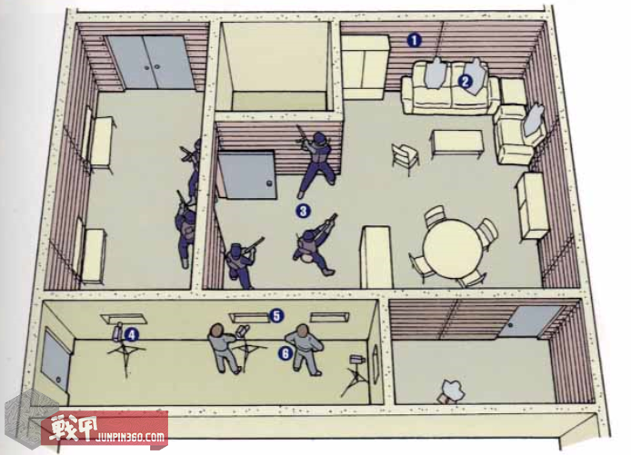
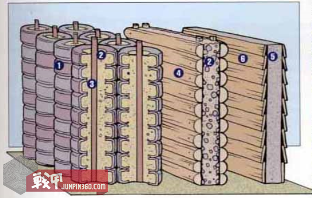
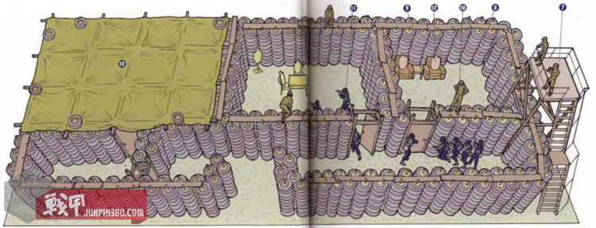
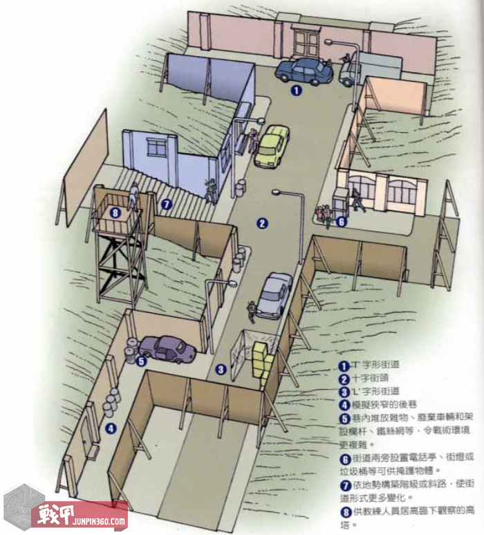

# 什么是Killing House?

>部分内容转载自[战甲军品JunPin360.Com](https://www.junpin360.com/html/2016-09-01/5207.html)

在玩csgo时，有一句反恐演员的语音提到了KillingHouse，这玩意是啥？

原句是：Remember, this isn't the killing house anymore, this is real life.

*记住，这不再是战斗模拟室，这是残酷的现实。*

## 杀人房killing house

杀人房是一个有防弹功能，可供特警队员做360度实弹射击训练的建筑物。是特警部队近距离战斗训练不可或缺的设施。它的大小 和结构没有固定规格，可以由一间用汽车轮胎堆砌而成的露天建筑，或由混泥土建筑构成的一条街道，完全看所在单位的钱袋子决定。

设于室内的杀人房通常空间有限，间隔结构缺少灵活性，不利于整支部队同时大规模训练，但室内环境的优点是不受气候影响，在光线完全受控的环境下进行，适合作小组队员的精确战术动作训练。房间内的墙壁上铺厚木板或橡胶等材料，以便吸收子弹的冲击力和防止发生跳弹。所有的走廊、门窗的空间大小均仿制正规建筑物的标注，并布置简单家具。队员不单可以在不同亮度光线下进行训练，室内还可以施放催泪弹和烟雾弹，增加训练的难度和真实感。

为了方便进行事后分析检讨，通常做毗邻的房间架设录像设备，透过镶嵌防弹玻璃的小窗，将训练过程录下来，供时候分析研讨使用。

图注：
    
    1 后木板墙
    
    2 模拟靶子
    
    3 训练队员
    
    4 录像器材
    
    5 防弹玻璃窗
    
    6 教官

## 轮胎房Tire House

室外的杀人房除了空间较宽敞，可供人数较多的小组同时进行训练外，更因为可以用便宜的材料（如废旧轮胎）来搭建，财政负担小，因此成为大部分特警队必备的训练场所。

无论以任何形式、材料搭建的室外杀人房，共同的要求都是要有超过2.5米的墙壁高度，顶部四周架设木板桥和高塔以便教官可以居高临下多角度观察队员的训练情况。

最廉价而有效的建设方法是利用木桩和架子将汽车轮胎堆叠，内部填充沙石，并排构成防弹墙壁。轮胎间缺点是受论坛直径影响墙壁占用较多的空间。

另一种方法是建设中控的木结构墙壁，内部再填充沙石，这种结构的优点是墙上还可以加上窗户和门，是训练环境更加逼真。

当然，最理想的方法是采用水泥预制板搭建，内外表面都如同室内杀人房铺上木板或者橡胶防止跳弹。但造价昂贵，只能有钱土豪单位才能办到。

墙体结构：

1废旧轮胎两行交错排列。

2内填沙石

3木桩

4中控厚木墙

5预制水泥板

6内外铺设厚木板

轮胎房俯视图：

7控制塔台

8轮胎两行交错排列，确保没有空隙让弹头钻过。

9板桥

10教官

11训练队员

12模拟靶子

13顶部覆盖帆布，构成低光环境。

## 模拟街道

与轮胎房，杀人房等赵燕玉实弹射击训练的训练设施不同，模拟街道可以让特警队训练战术机动、目标识别、战术手语和推进队形等需要团队默契密切配合的技巧。

模拟街道一般以木结构组成，方便每隔一段时间后变更不惧。凹陷的低地或者盆地是设置模拟街道的理想地点，除了进行实弹射击训练时，不会对四周环境构成危险外，不同的水平面和斜面更可以模拟依山而建的街道，另训练环境更多变化。

1 T字形街道

2 十字形街道

3 L形街道

4模拟狭窄的胡同

5巷内堆放杂物、废弃车辆和设置栏杆、铁丝网等、使环境更加复杂。

6街道两侧设置电话亭、路灯和垃圾桶等可供掩护的物体。

6依据地形构件台阶或者斜坡路，使街区地形更多变化。

8供教官居高临下观察的高塔。

## 训练场地的管理

场地训练虽然是特警队训练重要的一环，但是当出现下列情况，训练的效果就会大打折扣：

Q小队在同一个不惧的训练场地内经过多次训练后，对内部空间结构十分熟悉，是训练失去难度和变化。

A此时训练管理部门的应对方法是在外面寻找一些可用作训练的废弃建筑物，安排特警队在实际环境中进行更加逼真的训练，使训练工作进入新阶段。

Q训练场地的门窗等障碍物做训练中受损破坏，没有及时维修，令队员后续的训练做缺少真实和缺乏难度的情况下进行，失去训练的意义。

A有效的训练管理部门除了会对训练场所的整体结构维持严格维护保养，确保门窗等装置的完整、坚固外，更会不时改变内部的布局和家具的安放位置，避免出现一成不变、日久失修的现象。

为了使队员在训练场的训练工作能得到最佳效果，教官都会采取如下的安排：

队员按实际执行任务般穿上全部装备，包括：战术背心，防弹衣，头盔，防毒面具和弹药等。

按训练场里布置的模拟靶数量，队员平均每个靶子配两发子弹，这样在训练完成后，从每个队员消耗的子弹数量就可以知道其首发命中率。

进行空枪模拟训练时，安排其他队员在目标房间里，留心聆听训练队员接近时的动静和观察其破门进入的动作技巧，并在训练后参与研讨和评审。

将模拟匪徒和人质的模拟靶混合布置，提高队员射击前的目标识别难度。

**光源**

实现环境中，特警队有很大机会在晚上执行任务，即使在白天，建筑物内的走廊，密室，地下室都是光线昏暗的，因此队员要练习在不同光线下（例如：日光、低光环境以及伸手不见五指的漆黑情况）和光源（泛光灯、强光手电、汽车大灯和探照灯）等多种条件下进行作战，以适应多变的环境。

**噪音**

特警队的训练场地与居民要想个一段距离，理由很简单，训练中发出的爆炸声已经震撼弹的声音都会对环境造成很大的滋扰。

可惜现代城市不断扩展，令适合做特警训练场地而且又不会扰民的地方越来越少。但为了使队员能够有完整的爆破训练，一个允许有爆炸声响的训练场是必须的，在这一点上，任何特警队和训练单位都不会妥协。

**安全措施**

安全措施是任何射击训练里最重要的一环，对于特警队这种360度高强度射击训练来说，安全的考虑就更加重要。即使在休息时，队员都要时刻十分留意武器的枪口指向，不仅枪口不要指向队员，更不要枪口对天，因为房顶的木板桥上可能有教官。

每组队员在进入训练场地进行实弹训练前，都要先空枪在场地内慢走一次，以了解内部环境，然后再快速来回跑几次，直到队员和教官都感到满意和心安，然后再开展正式的实弹训练。

---

**除此之外，csgo探员语音还有：**

Easy peasy, lemon squeezy!这太简单了！   （跟切柠檬一样简单）

Bingo, bango, bongo, bish, bash, bosh!（无直译，用来形容刚刚做过的事情有很高的效率）

Remove any doubts in your head; it's us, or them.去掉心中的一切杂念，不是他们死，就是我们亡。

They're gonna wish they were never born.他们会希望自己从未出生。

Let's show them who we are.让我们向他们展示我们是谁。

That's all you got? Are you kidding me?你就这点本事？你在逗我吗？

They won't even remember today.他们永远也忘不了今天。

Justice will be ours!正义将会是属于我们的！

We will dance on your graves.我们将会踩着你们的坟墓跳舞。