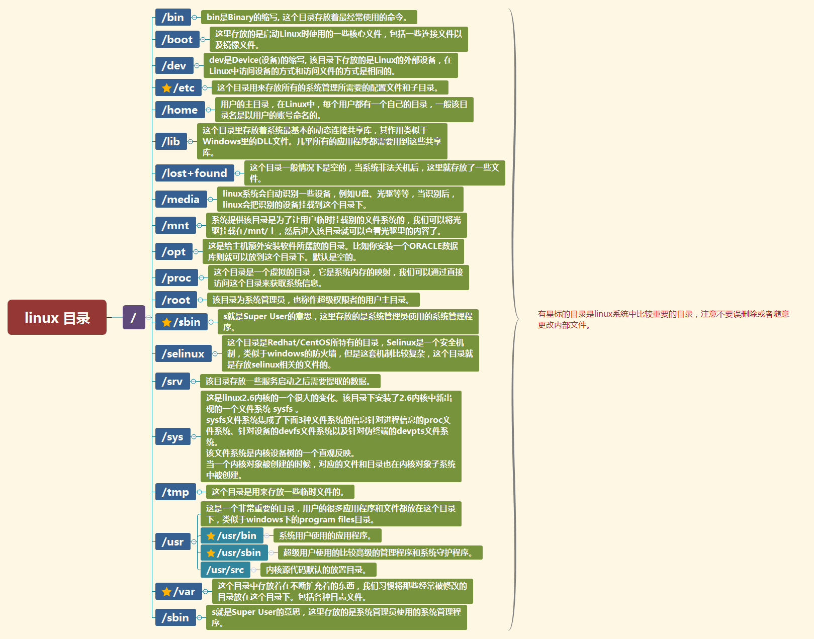

linux仿真环境：

* jslinux:：http://bellard.org/jslinux/
* JS/UIX ：http://www.masswerk.at/jsuix/index.html
* cb.vu：http://cb.vu/

## Linux主要命令

### Linux 文件目录管理

#### Linux 目录结构



#### Linux 文件属性

Linux 系统是一种典型的多用户系统，不同的用户处于不同的地位，拥有不同的权限。为了保护系统的安全性，Linux 系统对不同的用户访问同一文件（包括目录文件）的权限做了不同的规定。 在 Linux 中我们可以使用 ll 或者 ls –l 命令来显示一个文件的属性以及文件所属的用户和组

```shell
➜  /tmp ll
total 0
drwxr-xr-x@ 2 evan  wheel    64B  6  7 15:15 1
-rw-r--r--@ 1 evan  wheel     0B  6  7 15:15 1.txt
```

接下来的字符中，以三个为一组，且均为『rwx』 的三个参数的组合。其中，r 代表可读(read)、w 代表可写(write)、x 代表可执行(execute)。 要注意的是，这三个权限的位置不会改变，如果没有权限，就会出现减号 - 而已。


```shell
sudo chmod -R 755 /path/to/dict
```

* 对于文件来说，它都有一个特定的拥有者，也就是对该文件具有所有权的用户。
* 同时，在 Linux 系统中，用户是按组分类的，一个用户属于一个或多个组。
* 文件拥有者以外的用户又可以分为文件拥有者的同组用户和其他用户。

#### 文件目录命令

`cd`,`ls`,`pwd`,`mkdir`,`tree`,

`touch`,`ln`,`chmod`,`chown`,`find`,

`cp`,`scp`,`mv`,`rm`


### Linux文件查看编辑

* 连接文件并打印到标准输出设备 - 使用 cat
* 显示指定文件的开头若干行 - 使用 head
* 显示指定文件的末尾若干行，常用于实时打印日志文件内容 - 使用 tail
* 显示文件内容，每次显示一屏 - 使用 more
* 显示文件内容，每次显示一屏 - 使用 less
* 自动编辑一个或多个文件；简化对文件的反复操作；编写转换程序等 - 使用 sed, awk
* 文本编辑器 - 使用 vi/vim
* 使用正则表达式搜索文本，并把匹配的行打印出来 - 使用 grep

### Linux 文件压缩和解压

#### tar

```shell
tar -cvf 1.tar 1.txt            # 仅打包，不压缩
tar -zcvf 1.tar.gz 1.txt        # 打包后，以 gzip 压缩
tar -jcvf 1.tar.bz2 1.txt       # 打包后，以 bzip2 压缩

tar -ztvf 1.tar.gz              # 查阅上述 tar 包内有哪些文件
tar -zxvf 1.tar.gz              # 将 tar 包解压缩
```
#### gzip

gzip 命令用来压缩文件。gzip 是个使用广泛的压缩程序，文件经它压缩过后，其名称后面会多出“.gz”扩展名。

gzip 是在 Linux 系统中经常使用的一个对文件进行压缩和解压缩的命令，既方便又好用。gzip 不仅可以用来压缩大的、较少使用的文件以节省磁盘空间，还可以和 tar 命令一起构成 Linux 操作系统中比较流行的压缩文件格式。据统计，gzip 命令对文本文件有 60%～ 70%的压缩率。减少文件大小有两个明显的好处，一是可以减少存储空间，二是通过网络传输文件时，可以减少传输的时间。

```shell
gzip * # 将所有文件压缩成 .gz 文件
gzip -l * # 详细显示压缩文件的信息，并不解压
gzip -dv * # 解压上例中的所有压缩文件，并列出详细的信息
gzip -r log.tar     # 压缩一个 tar 备份文件，此时压缩文件的扩展名为.tar.gz
gzip -rv 1/      # 递归的压缩目录
gzip -dr 1/      # 递归地解压目录
```

#### zip

zip 命令可以用来解压缩文件，或者对文件进行打包操作。zip 是个使用广泛的压缩程序，文件经它压缩后会另外产生具有“.zip”扩展名的压缩文件。

```shell
zip -q -r 1.zip *
```

### Linux 系统管理

* 查看 CPU 信息 - 使用 cat /proc/cpuinfo
* 重新启动 Linux 操作系统 - 使用 reboot
* 退出 shell，并返回给定值 - 使用 exit
* 关闭系统 - 使用 shutdown
* 查看或设置系统时间与日期 - 使用 date
* 查看系统当前进程状态 - 使用 ps
* 删除当前正在运行的进程 - 使用 kill

#### date
```shell
# 格式化输出
date +"%Y-%m-%d"
2024-06-07

# 输出昨天日期
date -d "1 day ago" +"%Y-%m-%d"
2024-06-06
```

### Linux网络管理


* 下载文件 - 使用 curl、wget
* telnet 方式登录远程主机，对远程主机进行管理 - 使用 telnet
* 查看和设置系统的主机名 - 使用 hostname
* 查看和配置 Linux 内核中网络接口的网络参数 - 使用 ifconfig
* ssh 方式连接远程主机 - 使用 ssh
* 为 ssh 生成、管理和转换认证密钥 - 使用 ssh-keygen
* 查看域名信息 - 使用 host, nslookup
* 测试主机之间网络是否连通 - 使用 ping
* 追踪数据在网络上的传输时的全部路径 - 使用 traceroute
* 查看当前工作的端口信息 - 使用 netstat


#### hostname

hostname 命令用于查看和设置系统的主机名称。环境变量 HOSTNAME 也保存了当前的主机名。在使用 hostname 命令设置主机名后，系统并不会永久保存新的主机名，重新启动机器之后还是原来的主机名。如果需要永久修改主机名，需要同时修改 /etc/hosts 和 /etc/sysconfig/network 的相关内容。

#### host/nslookup

host 命令是常用的分析域名查询工具，可以用来测试域名系统工作是否正常。

#### traceroute

traceroute 命令用于追踪数据包在网络上的传输时的全部路径，它默认发送的数据包大小是 40 字节。
#### netstat

netstat 命令用来打印 Linux 中网络系统的状态信息，可让你得知整个 Linux 系统的网络情况。

### Linux 硬件管理

* 查看磁盘空间 - 使用 df
* 查看文件或目录的磁盘空间 - 使用 du
* 实时查看系统整体运行状态（如：CPU、内存） - 使用 top
* 查看已使用和未使用的内存 - 使用 free

#### df（Disk Free）

df 命令用于显示文件系统的磁盘空间使用情况。它报告的是整个文件系统的使用情况，而不是单个目录或文件的使用情况。

常用选项：

* -h：以人类可读的格式显示，自动使用适当的单位（如KB、MB、GB）。
* -T：显示文件系统类型。
* -i：显示inode使用情况。

使用示例：`df -h`

输出示例：
```shell
Filesystem      Size  Used Avail Use% Mounted on
/dev/sda1        50G   15G   33G  31% /
tmpfs           3.9G  1.1M  3.9G   1% /run
/dev/sda2       100G   45G   56G  45% /home
```

#### du（Disk Usage）

du 命令用于显示特定目录或文件的磁盘使用情况。它可以递归地显示每个子目录的磁盘使用情况，非常适合查找哪些目录占用了大量空间。

常用选项：

* -h：以人类可读的格式显示，自动使用适当的单位（如KB、MB、GB）。
* -s：显示指定目录或文件的总计。
* -a：显示所有文件和目录的磁盘使用情况。
* --max-depth=N：限制递归显示的深度。

使用示例：`du -h --max-depth=1 /home`

输出示例：

```shell
1.1G    /home/user1
500M    /home/user2
20G     /home/user3
21.6G   /home
```

区别总结

* df： 
    * 用于查看整个文件系统的磁盘空间使用情况。
    * 通常用来检查整体磁盘空间和文件系统的使用状态。
    * 输出信息包括文件系统类型、总空间、已用空间、可用空间和挂载点。

* du：
    * 用于查看特定目录或文件的磁盘使用情况。
    * 通常用来查找哪个目录或文件占用了大量空间。
    * 可以递归地显示子目录和文件的使用情况，提供详细的目录大小信息。

#### top

top 命令可以实时动态地查看系统的整体运行情况，是一个综合了多方信息监测系统性能和运行信息的实用工具。通过 top 命令所提供的互动式界面，用热键可以管理。

#### free

free 命令可以显示当前系统未使用的和已使用的内存数目，还可以显示被内核使用的内存缓冲区。

```shell

free -t    # 以总和的形式显示内存的使用信息
free -s 10 # 周期性的查询内存使用信息，每10s 执行一次命令

# 显示内存使用情况

free -m
             total       used       free     shared    buffers     cached
Mem:          2016       1973         42          0        163       1497
-/+ buffers/cache:        312       1703
Swap:         4094          0       4094
```

### Linux 软件管理

* rpm (red-hat)
* yum (Fedora 和 RedHat)
* apt-get (Debian) 


### Linux grep

* -i：忽略大小写进行匹配。
* -v：反向查找，只打印不匹配的行。
* -n：显示匹配行的行号。
* -r：递归查找子目录中的文件。
* -l：只打印匹配的文件名。
* -c：只打印匹配的行数。
* -A<显示行数> 或 --after-context=<显示行数> : 除了显示符合范本样式的那一列之外，并显示该行之后的内容。
* -B<显示行数> 或 --before-context=<显示行数> : 除了显示符合样式的那一行之外，并显示该行之前的内容。
* -e 支持多个pattern
* -E 或 --extended-regexp : 将样式为延伸的正则表达式来使用。
* -o 或 --only-matching : 只显示匹配PATTERN 部分。
* -w 或 --word-regexp : 只显示全字符合的列。

### Linux新建用户，授予sudo权限

```shell
sudo useradd -m 用户名
```

```shell
sudo passwd 用户名
```

```shell
sudo usermod -aG sudo username
groups username
```

### Linux关闭ssh密码登录

```shell
sudo nano /etc/ssh/sshd_config
```

找到以下行：

`#PasswordAuthentication yes`

修改该行，去掉注释并将yes改为no：

`PasswordAuthentication no`

```shell
sudo nano .ssh/authorized_keys
```


## Ubuntu安装vsftpd

```
sudo apt-get update
sudo apt-get install vsftpd
vsftpd -v
```
```
sudo nano /etc/vsftpd.conf
```

``` 
# 示例配置文件，地址： /etc/vsftpd.conf

# 用来设置vsftpd是否以独立守护进程运行。
# 如果设置为"listen=YES"，则表示vsftpd将作为独立守护进程运行；
# 如果设置为"listen=NO"，则表示vsftpd将不会以独立守护进程运行，而是通过inetd或者initscript启动。
listen=NO
#
# 设置vsftpd是否启用IPv6监听。
# 如果设置为"listen_ipv6=YES"，则表示vsftpd将启用IPv6监听；
# 如果设置为"listen_ipv6=NO"，则表示vsftpd将不会启用IPv6监听。
# 默认情况下，IPv6监听地址为"::"，同时可以接受IPv6和IPv4客户端的连接。
# 如果你只需要监听IPv4或IPv6地址，则不需要同时启用两种监听，如果你需要同时监听特定的IPv4和IPv6地址，则需要运行两个vsftpd实例，并使用两个不同的配置文件来进行配置。
listen_ipv6=YES
#
# 设置是否允许匿名FTP登录。
anonymous_enable=NO
#
# 设置是否允许本地用户登录FTP服务器。
local_enable=YES
#
# 设置是否允许FTP用户执行写入操作。
write_enable=YES
#
# 设置本地用户的默认umask值。
# umask是一个三位八进制数，用来控制新建文件或目录的访问权限。
# 在FTP服务器中，local_umask选项用来设置本地用户上传文件或创建目录时的默认权限。
# 默认情况下，local_umask的值为077，表示新建的文件或目录权限为只有所有者可读、可写、可执行，其他用户无权访问。
# 如果你的用户希望默认权限为所有者可读、可写、可执行，其他用户可读、可执行，则可以将local_umask的值设置为022。
local_umask=022
# 这段配置文件是用来设置是否启用目录消息功能。
# 如果设置为YES，则表示启用目录消息功能。当远程用户进入某个目录时，会显示该目录的消息。
dirmessage_enable=YES
#
# 设置是否启用本地时间功能。
# 启用本地时间功能后，vsftpd将会在目录列表中显示本地时间而非GMT时间。
use_localtime=YES
#
# 启用上传和下载日志记录功能。
# 启用该功能后，vsftpd会记录每个用户的上传和下载操作，并将其记录到指定的日志文件中。
xferlog_enable=YES
#
# 设置数据传输的端口号。
# 将其值设置为YES，则表示数据传输使用的端口号为20。
connect_from_port_20=YES
# 设备限制本地用户仅访问其home目录。
# 如果启用，则本地用户将仅访问其home目录和其子目录，无法访问其他目录。
chroot_local_user=YES
#
# 是否允许本地用户，是否将本地用户限制在其主目录中，如果设置为YES，则不会将列在chroot_list_file中的用户限制在其主目录中。
# chroot_local_user=YES
# 是否启用chroot_list_file列表，用于指定哪些用户不应该被限制在主目录中。
chroot_list_enable=YES
# 指定了chroot_list_file列表的路径和名称。一行一个用户名。
chroot_list_file=/etc/vsftpd.chroot_list
allow_writeable_chroot=YES
#
# 指定vsftpd将使用的PAM服务的名称。
# 默认情况下，pam_service_name的值为“vsftpd”，这意味着vsftpd将使用名为“vsftpd”的PAM服务来进行认证。
# 如果需要使用其他的PAM服务，可以修改该选项的值。
pam_service_name=vsftpd

# 是否启用SSL加密连接。
ssl_enable=NO

```

```
sudo nano /etc/vsftpd.chroot_list
```

将刚刚创建的FTP用户添加进去.

```
sudo service vsftpd restart
```

使用`ps -aux | grep vsftpd` 查看服务是否启动

---

## Ubuntu安装JDK

```
sudo apt install openjdk-8-jdk
```
```
sudo apt install default-jdk
```
```
sudo apt install default-jre
```