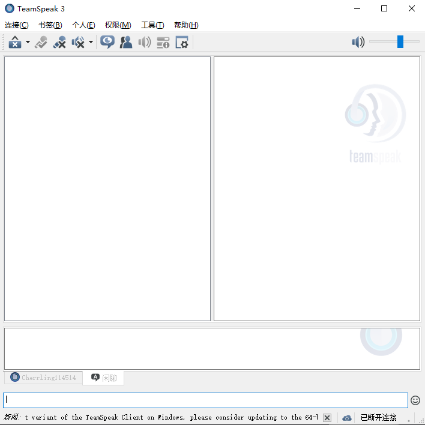
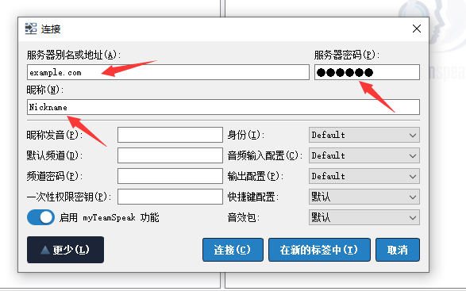
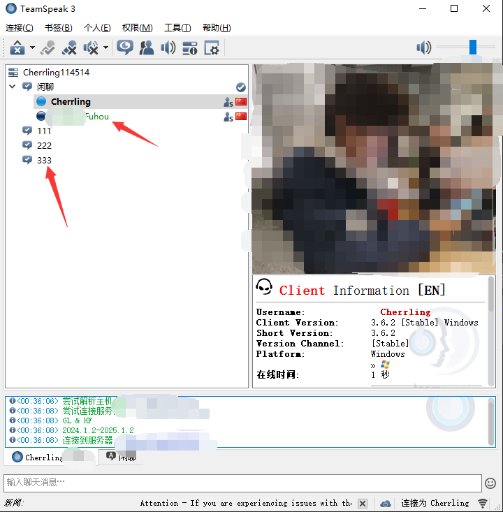
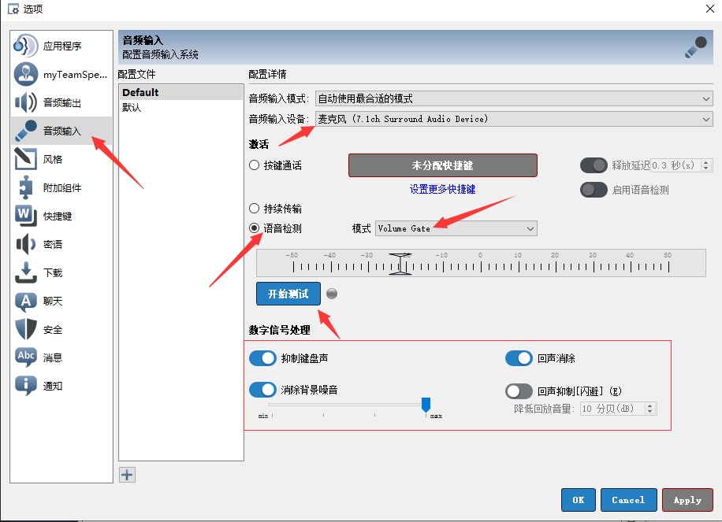

# TeamSpeak速通教程

> 感谢[TeamSpeak中文站](https://teamspeak.app/)提供的汉化包

## 为什么使用 TeamSpeak

KOOK吃相难看，为了让你买他的会员，非会员就限时降噪，没降噪就人为给你加底噪

国内一众VoIP做的臃肿不堪，同时内存占用大

Discord国内连不上

## 使用方法

!> 请务必不要某国内公司制作的中文翻译版，该版本过旧，无法登陆现有的大部分 TeamSpeak 服务器。详见[为何不要使用 ts1.cn](https://teamspeak.app/docs/advanced/why-not-ts-cn/)

首先，你需要在电脑端下载TeamSpeak客户端和汉化包，你可以在[这里](https://cherrling.lanzouo.com/iTjv61ov8kej)或者[TS中文站](https://teamspeak.app/)进行下载

下载并运行安装包后，一路下一步直至安装完成。然后双击汉化文件`Chinese_Translation_zh-CN.ts3_translation`，就可以自动安装TS的汉化包。

安装汉化包后重启TeamSpeak，你应该会看到这样的界面

点击左上角的`连接` - `连接服务器`

你只需要在这三个地方依次填入你要连接的服务器地址，服务器密码以及你希望别人看到你的昵称。

如果服务器没有加密，就把密码位置留空

成功登入后，你应该可以看到类似这样的界面

左侧代表当前服务器的不同频道，只有在同一频道里的人可以互相听见声音。

## 调整感应麦

在客户端上方找到 `工具` - `设置`

选择 `音频输入(Capture)` 选项卡，设置好你想使用的麦克风设备，选择`语音检测` - `Volume Gate` 模式

点击开始测试，尝试对麦克风以正常音量说话，同时调节音量条上的滑杆。尽量使滑杆处在讲话时音频峰值以左，打字等杂音峰值以右。

一般情况下，推荐打开下方的回声抑制(Echo reduction) 回声消除(Echo cancellation) 以及 高级选项(Advanced Options)，但具体请根据个人情况及设备的不同，自行判断。

