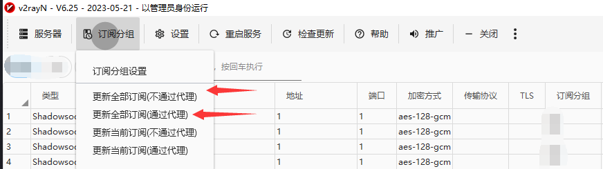

## 我该怎么获得订阅链接/服务器地址？

如果你是从我这里白嫖的机场，那我发给你的那串链接就叫做订阅链接

[免费v2链接](https://gh.api.99988866.xyz/https://raw.githubusercontent.com/aiboboxx/v2rayfree/main/v2)

[免费clash链接](https://gh.api.99988866.xyz/https://raw.githubusercontent.com/aiboboxx/clashfree/main/clash.yml)

如果你想自己租用机场，可以看这里 [机场合集](https://9.234456.xyz/abc.html)

## 使用教程

### WINDOWS教程

首先你得下一个叫v2rayN的东西，

下载地址：https://github.com/2dust/v2rayN/releases

V2RayN 客户端工具下载地址：https://github.com/2dust/v2rayN/releases/download/6.29/v2rayN-32.zip

然后你下载解压之后，复制订阅链接，打开软件

先点击上面的“订阅分组”，再点击“订阅分组设置”

点击添加，然后随便填一个名字，下面填订阅链接

最后回到主界面，点订阅分组，选择更新全部订阅，一个不好使就换另一个。

### 安卓手机教程

首先你得下一个软件

V2RayNG 软件 https://github.com/2dust/v2rayNG/releases/download/1.8.9/v2rayNG_1.8.9.apk

点订阅设置，添加服务器后退回主界面，点右上角三个点-`更新订阅`

>点击图片可放大

